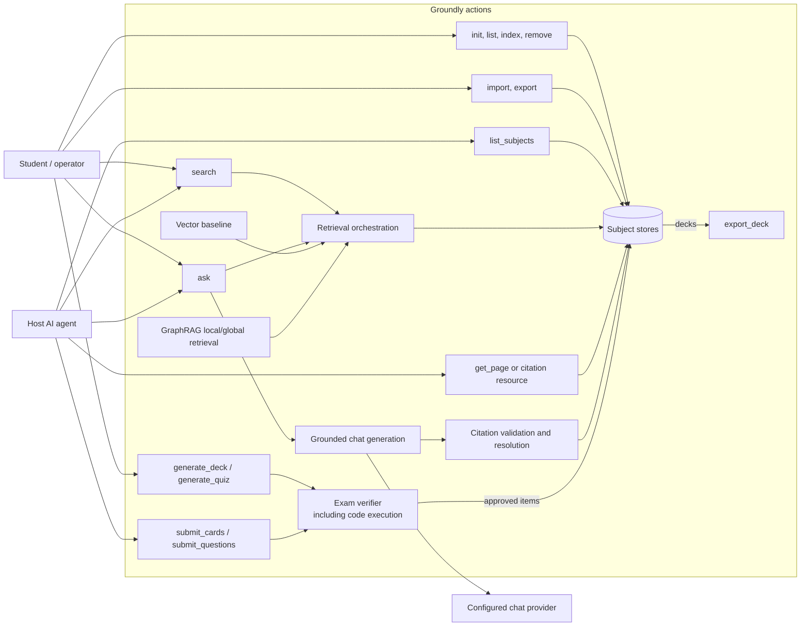

# Agent Layer

Expands [`groundly-spec.md`](../groundly-spec.md) §5b. Governing rule: **agents only where the system must decide, iterate, or use tools mid-task** — everything else is a pipeline. Specialization is data, never code: "which subject" is literally which `~/.groundly/<SUBJECT>/` directory is open. Loops are **plain bounded async functions** — LangGraph was dropped when the roster shrank (consolidation pass).

## Actors and actions

Groundly connects student workflows and host-agent workflows through a shared
retrieval, generation, verification, and storage layer.

`search` is a raw, read-only retrieval action; `ask` adds generation and citation
resolution. Ingestion, sharing, generation, and verification contribute to the subject
bundle, while removal is destructive and requires confirmation unless explicitly
bypassed from the CLI.

## The roster (two)

### 1. Ask pipeline — interactive

`vector retrieval (dense + sparse + BM25 → RRF → rerank) → trust-layered prompt assembly → generation (chat call class) → citation resolution → cited answer or "not covered" → trace row.`

**No router, and one arm** (decision 28). The pipeline used to open with a `classify()` call selecting between `vector`, `hybrid-local` and `graph-global`. `ask()` now calls the vector arm unconditionally — one fewer provider round-trip per question — because on apd the vector arm leads hit and recall at every matched cutoff the product uses, and with one arm in `PRODUCT_ARMS` a classifier has nothing to select.

**Shipping one arm is not the same as having one arm.** All three stay runnable through `retrieval/arms.py`'s `retrieve_for_arm` and `groundly eval`, and what each costs in quality, money and time is a published comparison (`docs/thesis/`) rather than a deleted branch — the product takes the winner, the thesis takes the measurement. The graph itself is untouched and still serves `drill_down`/`overview` (UC-12).

Exposed identically as the MCP `ask` tool and the `groundly ask` CLI verb — **the product tool and the evaluation instrument are one function**. Grounding is enforced inside this boundary: a response with zero resolvable citations is an error; insufficient context returns the refusal, never model knowledge.

Honest scope note: host agents may prefer raw `search` (free, composable) and compose their own answers — that path is best-effort grounding by construction, and the eval *measures* the gap (grounding-fidelity experiment) rather than pretending it away.

### 2. Exam verifier — the identity of generation

Generation is pluggable; **verification is not**. Every question/card entering `store.db` passes, per type:

- **All types:** answerable from the cited chunks alone (confirmed by re-retrieval); answer key correct; distractors actually wrong (MCQ).
- **Code questions (incl. UC-13 challenges):** the reference solution is **executed in a subprocess** (timeout, tempdir) — compile + run + output matches. A hard guarantee, not an LLM opinion.

Two doors, one gate:

| Path | Generator | Needs API key | Loop |
|---|---|---|---|
| Thick: `generate_deck` / `generate_quiz` | Groundly (generation call class) | yes | generate → verify → regenerate, max 2 retries, then drop + note in batch report |
| Thin: `submit_cards` / `submit_questions` | The host agent, from `search` results | no | verifier returns machine-readable rejections (`not_answerable_from_chunks`, `wrong_answer_key`, `reference_solution_failed`, …); the host regenerates conversationally |

Verified items record their generation source — **rejection rate by source** is a thesis measurement. Verified decks live in `store.db` (exported: one student pays the verification cost, the course imports the deck) and leave the system as Anki `.apkg` via `export_deck`. Forward-compat: the generation interface is shaped so MCP sampling (host-paid tokens, server-controlled loop) can slot in later; not depended on.

## Not agents (deliberately)

- **Gap analysis / study planning** — SQL over `progress.db` quiz events joined to graph communities, plus at most one LLM call to phrase a plan. Weak-area quizzing = the exam path with retrieval weighted toward weak communities.
- **Study memory** — `recent_activity` is a SQL rollup (by day, not session — stdio lifecycle makes sessions unobservable); `remember`/recall is a table; the `continue-studying` MCP prompt bundles them. No server-side LLM summarization: the consumer is an LLM and narrates structured rollups on demand.
- **Code tutoring** — the host coding agent does this, grounded via `search`/`ask`. Dropped as a native agent (pivot #2); the enforced Socratic stance was the trade-off, documented.

## Prompt assembly & trust layering

Fixed layers; lower never overrides higher:

| Layer | Content | Mutability |
|---|---|---|
| 1. System (immutable) | Grounding rules, citation mandate, refusal on insufficient context | Code, versioned |
| 2. Subject profile | Notation conventions, emphasis, exam format — per subject, user-editable, shippable in exports | Markdown, **size-capped, trusted content never trusted authority** — cannot disable grounding; imported profiles inherit the same constraints |
| 3. Task parameters | Subject, topic, difficulty, question types | Request-scoped |
| 4. Retrieved chunks, graph summaries, **imported KB content**, recalled notes, user input | **Fully untrusted — data, never instructions** | Delimited, quoted; instructions inside are inert by construction of layer 1 |

Imports are the threat that keeps layer 4 honest: a shared knowledge base is third-party content that will enter prompts. Your own lecture PDFs get the same treatment — injection via slides is as real as via imports.

## Latency classes

Interactive (`ask`, `search`): straight pipeline, no background machinery. Generation (decks, quizzes, graph build): background task behind a job id — **never block a request handler on an agent loop**. When the configured provider is a local runtime, generation jobs are serialized (GPU contention with interactive use); as implemented, one process-wide lock serializes *all* thick generation jobs — stricter than required, free for a single student.

Jobs are **session-scoped, not durable**: the job registry lives in the MCP server process's memory, and verified items commit to `store.db` per item — a killed host session loses at most the job record and batch report, never a verified card. On a promptless surface, "cost estimates before spending" becomes a two-phase call: `generate_*` with `confirm=false` (default) returns only the estimate; `confirm=true` starts the job.

## Observability

Every `ask`/generation run records its trajectory — arm, path, chunk ids, verifier verdicts, tokens, cost, latency — into the `traces` table in **`progress.db`** (personal; never exported; the thesis artifact ships the author's own). Retrofitting logging makes the comparison unreproducible; it exists from P3.
