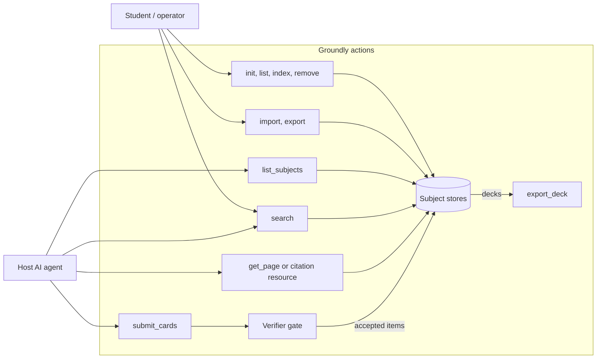

# Verification & Trust

Expands [`groundly-spec.md`](../groundly-spec.md) §5b. Governing rule: **Groundly verifies; the host generates.** An MCP host is already an LLM, so a second model behind the tool surface paid twice for the same capability (decision 33). What is left is one gate and one trust rule.

## Actors and actions

```mermaid
flowchart LR
    student[Student / operator]
    host[Host AI agent]

    subgraph Groundly[Groundly actions]
        init[init, list, index, remove]
        share[import, export]
        discover[list_subjects]
        search[search]
        page[get_page or citation resource]
        submit[submit_cards]
        verify[Verifier gate]
        stores[(Subject stores)]
        exportdeck[export_deck]
    end

    student --> init --> stores
    student --> share --> stores
    student --> search
    host --> discover --> stores
    host --> search --> stores
    host --> page --> stores
    host --> submit --> verify
    verify -->|accepted items| stores
    stores -->|decks| exportdeck
```

## The verifier gate

Every card entering `store.db` passes, in fail-fast order:

1. **Citations present** — a card with no `chunk_ids` is rejected.
2. **Citations resolve** — each id must name a chunk in this subject; unresolvable ids are named in the rejection, and the FK enforces it a second time at insert.
3. **Answerable by re-retrieval** — re-retrieving the card's own front+back text must surface at least one cited chunk within `VERIFY_TOP_K`.

Rejections are machine-readable (`REJECTION_REASONS`), so a host regenerates conversationally without a human in the loop. Verification is **zero-key**: it touches only the local embedder.

Planned checks, each with its sub-project: structural answer-key and distractor checks for MCQs (2), subprocess execution of code answers (4). Until the runner exists, no code question may be stored — the guarantee is unbuilt, not weakened.

## Trust layers

Fixed layers; lower never overrides higher:

| Layer | Content | Mutability |
|---|---|---|
| 1. System (immutable) | The rules in whatever prompt Groundly assembles | Code, versioned |
| 2. Task parameters | Subject, topic, the entity types a graph build looks for | Request-scoped |
| 3. Chunk text, imported KB content, user input | **Fully untrusted — data, never instructions** | Delimited, quoted, inert |

Today the only prompts Groundly assembles are the graph build's (entity extraction and community reports), and the chunk text they carry is layer 3 — a hostile PDF gets the same treatment as an imported bundle. The MCP server's `instructions` and tool descriptions are layer 1 product text, measured rather than improvised (decision 31).

## Observability

The graph build records what it spent — model, tokens, cost, latency — in the `traces` table in **`progress.db`** (personal, never exported). Nothing else writes there: `search` is read-only, and verifier verdicts are no longer logged (decision 33). Mastery data arrives in sub-project 4.
