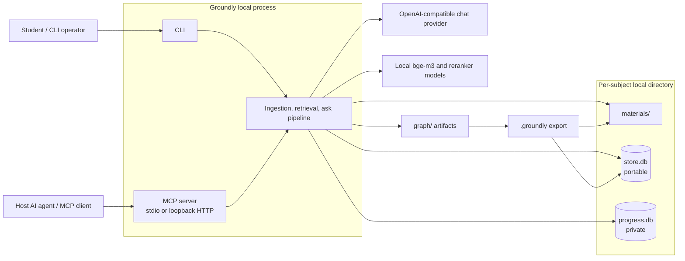

# Architecture Overview

Expands [`groundly-spec.md`](../groundly-spec.md) §4. Companions: [`data-model.md`](data-model.md), [`retrieval.md`](retrieval.md), [`agents.md`](agents.md), [`../infrastructure/distribution.md`](../infrastructure/distribution.md).

## Shape: one package, core with interchangeable clients

There is no server to deploy. The product is a local **core library** with thin clients over it — three student-facing, plus one research client (`eval/`). In MCP's stdio transport the "server" is a subcommand *spawned by the host agent* — there is no daemon for the student to manage.

```
groundly/
├── cli/         # typer verbs: init, index, list, remove, import, export, export-deck,
│             #   export-graph, ask, eval, config, models, mcp, serve
├── mcp/         # FastMCP tool definitions over the core (stdio + streamable HTTP)
├── web/         # static mastery dashboard, served by `serve` (P7)
├── eval/        # retrieval eval harness (decision 27): gold sets, metrics, runner.
│             #   A client by dependency direction — drives the arms, imported by
│             #   nothing. Research surface; no MCP tool or runtime path uses it.
├── assets/      # bundled data read via importlib.resources: theme.css, vendored
│             #   vis-network (see assets/VENDORED.md). A bare data dir like prompts/,
│             #   deliberately NOT under web/ so core/ can read it without a
│             #   foundation→client dependency
├── agents/      # ask pipeline (trust layers → gen → citation check); exam verifier gate
├── retrieval/   # four arms, router, fusion, rerank, citation resolution
├── ingestion/   # docling subprocess → HybridChunker → embed → stores; graphrag batch
├── llm/         # THE provider boundary: OpenAI-compatible client factory per call class
└── core/        # store access (SQLite WAL), manifest, subject registry, settings;
                 #   artifact rendering to a file (bundle .zip, anki .apkg, graph HTML)
```

### Module dependency rules

- **clients → services → foundations**, one direction: `cli`/`mcp`/`web`/`eval` call `agents`/`retrieval`/`ingestion`; those call only `llm`/`core`. **Nothing imports the client layer.**
- LLM and embedding clients are constructed **only** in `llm/` — no provider SDK usage anywhere else; every call passes through it and records cost into traces.
- `agents` calls `retrieval` (as a tool) and the subprocess runner. `retrieval` never calls `agents`.
- `ingestion` writes the stores; it never serves queries.

## System context and boundaries

Groundly is a local system whose portable knowledge-base artifacts are separate from
the student's private progress data.



`search` needs only the local retrieval models; `ask` additionally needs a configured
chat provider. The MCP stdio process is created by the host and is not a persistent
service. The HTTP option is intentionally loopback-only.

## Runtime modes & concurrency

| Mode | Process | Lifecycle |
|---|---|---|
| CLI verbs | `groundly index/import/export/ask/...` | one-shot, core in-process, exits |
| MCP stdio | `groundly mcp` | **spawned and killed by the host agent** |
| Optional HTTP | `groundly serve` | user-run; MCP-over-HTTP + dashboard; binds **127.0.0.1 only**; exists so multiple hosts share one bge-m3 load |

Multiple processes may open the same `store.db` (an `index` run while a host-spawned MCP process answers queries). Rules from day one: **WAL + busy_timeout** on every connection; **lazy model loading** (never at MCP spawn — hosts expect fast handshakes; load on first search); generation jobs **serialized when the provider is a local runtime** (GPU contention with interactive use).

## Request flows (latency classes)

| Class | Path | Notes |
|---|---|---|
| `search` (MCP) | `mcp → retrieval` | no LLM call; free; the host composes |
| `ask` (MCP ≡ CLI, minus `--arm`) | `agents.ask → retrieval.arms → retrieval → llm` | enforced pipeline; the evaluation instrument. Same function both ways; the CLI alone can select a non-default arm (decision 29) |
| Generation (decks/quizzes) | background task behind a job id | never block a handler on an agent loop |
| Ingestion | CLI, in-process, per-file transactions | resumable; hash-skip on re-run |

## Cross-cutting rules

- **Citations are structural**: retrieval returns chunk ids; generation must reference them; the core resolves ids → document/page (+ heading path). Zero resolvable citations = error, not a degraded answer.
- **Subject scoping is filesystem layout** — a query physically cannot cross subjects.
- **The privacy boundary is a file**: `store.db` exports; `progress.db` (quiz history, notes, traces) never does.
- **The verifier gates every write into decks/question banks**, regardless of who generated (thick server path or thin host path).
- **Trust layering** enforced at prompt-assembly time in `agents`: system rules > subject profile (capped, no authority over grounding) > task params > retrieved/imported content as delimited data.
