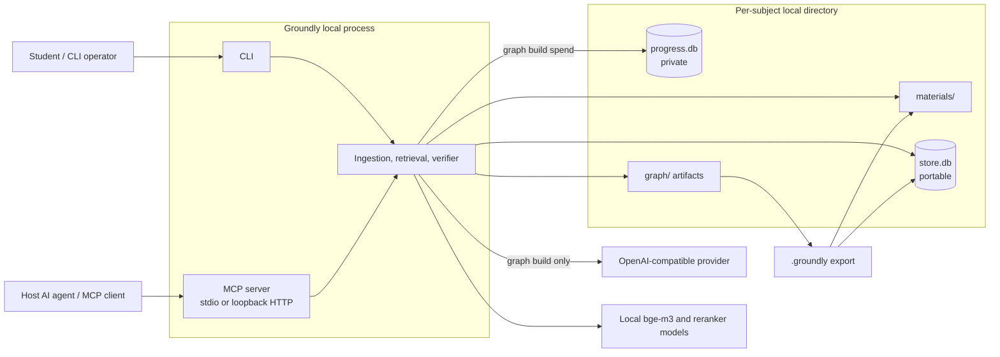

# Architecture Overview

Expands [`groundly-spec.md`](../groundly-spec.md) §4. Companions: [`data-model.md`](data-model.md), [`retrieval.md`](retrieval.md), [`agents.md`](agents.md), [`../infrastructure/distribution.md`](../infrastructure/distribution.md).

## Shape: one package, core with thin clients

There is no server to deploy. The product is a local **core library** with two clients over it. In MCP's stdio transport the "server" is a subcommand *spawned by the host agent* — there is no daemon for the student to manage.

```
groundly/
├── cli/         # typer verbs: init, index, list, remove, search, import, export,
│             #   export-deck, export-graph, config, models, mcp, serve
├── mcp/         # FastMCP tool definitions over the core (stdio + streamable HTTP)
├── assets/      # bundled data read via importlib.resources: theme.css, vendored
│             #   vis-network (see assets/VENDORED.md)
├── agents/      # the verifier gate — nothing unverified enters store.db
├── retrieval/   # dense + sparse + BM25, RRF fusion, cross-encoder rerank
├── ingestion/   # docling subprocess → HybridChunker → embed → stores; graphrag batch build
├── llm/         # THE provider boundary: one OpenAI-compatible client, graph build only
└── core/        # store access (SQLite WAL), manifest, subject registry, settings;
                 #   artifact rendering to a file (bundle .zip, anki .apkg, graph HTML)
```

### Module dependency rules

- **clients → services → foundations**, one direction: `cli`/`mcp` call `agents`/`retrieval`/`ingestion`; those call only `llm`/`core`. **Nothing imports the client layer** (`tests/test_layering.py`).
- LLM and embedding clients are constructed **only** in `llm/` — no provider SDK usage anywhere else.
- `agents` calls `retrieval` (the verifier re-retrieves). `retrieval` never calls `agents`.
- `ingestion` writes the stores; it never serves queries.

## System context


```mermaid
flowchart LR
    student[Student / CLI operator]
    host[Host AI agent / MCP client]
    provider[OpenAI-compatible provider]
    models[Local bge-m3 and reranker models]

    subgraph Groundly[Groundly local process]
        cli[CLI]
        mcp[MCP server\nstdio or loopback HTTP]
        services[Ingestion, retrieval, verifier]
        cli --> services
        mcp --> services
    end

    subgraph Subject[Per-subject local directory]
        materials[materials/]
        store[(store.db\nportable)]
        progress[(progress.db\nprivate)]
        graph_node[graph/ artifacts]
    end

    student --> cli
    host --> mcp
    services --> materials
    services --> store
    services --> models
    services -->|graph build only| provider
    services -->|graph build spend| progress
    services --> graph_node
    bundle[.groundly export] --> store
    bundle --> materials
    graph_node --> bundle
```

Search, verification and export need only the local models. The one path that reaches a provider is `groundly index --graph`.

## Runtime modes & concurrency

| Mode | Process | Lifecycle |
|---|---|---|
| CLI verbs | `groundly index/search/import/export/...` | one-shot, core in-process, exits |
| MCP stdio | `groundly mcp` | **spawned and killed by the host agent** |
| Optional HTTP | `groundly serve` | user-run; MCP over Streamable HTTP; binds **127.0.0.1 only**; exists so multiple hosts share one bge-m3 load |

Multiple processes may open the same `store.db` (an `index` run while a host-spawned MCP process answers). Rules: **WAL + busy_timeout** on every connection; **lazy model loading** (never at MCP spawn — hosts expect fast handshakes).

## Cross-cutting rules

- **Citations are structural**: retrieval returns chunk ids; the core resolves them to document/page (+ heading path). A community summary is never a citation target.
- **Subject scoping is filesystem layout** — a query physically cannot cross subjects.
- **The privacy boundary is a file**: `store.db` exports; `progress.db` never does.
- **The verifier gates every write into decks and question banks**, whoever generated the item.
- **The host composes answers.** Groundly returns cited chunks and verifies what comes back; it runs no answer-generation loop of its own (decision 33).
