# Retrieval Architecture (Hybrid RAG + GraphRAG)

Expands [`groundly-spec.md`](../groundly-spec.md) §5. This layer is the thesis's scientific core — every design choice must remain measurable and reproducible. Directive on file: **quality over performance** (Paul, 2026-07-15).

## The four arms (evaluation frame)

| Arm | Path | Exists to answer |
|---|---|---|
| 1. Vector baseline | dense + sparse + BM25 → RRF → rerank | Strong baseline; NotebookLM-class behavior |
| 2. Pure GraphRAG | MS `graphrag` local/global search | Does graph structure help multi-hop/global queries? |
| 3. Static hybrid | router → backend(s) → fusion → rerank | Does cheap routing capture most of the gain? **Production arm.** |
| 4. Adaptive agentic | retrieve → self-grade → escalate/rewrite (≤2 iterations) | Does self-evaluation beat static routing, at what cost? **Eval only.** |

The common LlamaIndex `Retriever` interface is what makes the comparison fair — same query in, same context format out, per-arm logging (arm, path, chunk ids, tokens, latency, cost) into the local `traces` table in `progress.db`.

## RAG pipeline

The retrieval layer supports vector, graph, hybrid, and adaptive retrieval paths
through one common context contract. `search` returns raw ranked chunks; `ask` adds
trust-layered generation and citation enforcement.

```mermaid
flowchart LR
    query[Question]
    search[search\nCLI or MCP]
    ask[ask\nCLI or MCP]
    contract[Shared LlamaIndex Retriever contract\nranked context with chunk metadata]
    vector[Arm 1: vector baseline\ndense + sparse + BM25 + RRF + rerank]
    gph[Arm 2: pure GraphRAG\nlocal or global search]
    route[Arm 3: cheap query router]
    hybrid[Static hybrid\nvector and/or graph]
    fuse[Fusion then rerank]
    adaptive[Arm 4: adaptive loop\nself-grade, escalate or rewrite\nmaximum 2 iterations]
    context[Ranked context\nverbatim chunks and graph summaries]
    prompt[Trust-layered prompt assembly]
    chat[Chat completion]
    cited{Resolvable retrieved citations?}
    answer[Cited answer]
    refusal[Refusal or citation error]
    traces[(Private traces\narm, path, chunks, tokens, cost, latency)]

    query --> search
    query --> ask --> route
    search --> vector
    route -->|factoid| vector
    route -->|multi-hop| hybrid
    route -->|global| gph
    query --> gph
    query --> adaptive
    adaptive -->|vector first| vector
    adaptive -->|escalate or rewrite| gph
    vector --> contract
    gph --> contract
    vector --> hybrid
    gph --> hybrid --> fuse --> contract
    contract --> context
    context -->|search: raw results| traces
    context -->|ask| prompt --> chat --> cited
    cited -->|yes| answer --> traces
    cited -->|no| refusal --> traces
```

## Components

### Vector baseline (arm 1; the hybrid's workhorse)

Three channels, all derived at index time, fused at query time:

1. **Dense**: bge-m3 (pinned incl. hf_revision), 1024-d, sqlite-vec **brute-force = exact KNN**. This is an accuracy *upgrade* over the archived design's approximate HNSW — at 5k–50k chunks/subject the exact scan costs milliseconds. LanceDB/IVF is the named escape hatch if a corpus ever explodes.
2. **Learned sparse**: bge-m3's sparse lexical weights — same forward pass as dense, stored as an inverted table. Handles Romanian morphology far better than raw tokenization. (bge-m3's ColBERT vectors are **rejected**: ~100× storage would bloat the portable bundle.)
3. **BM25**: SQLite FTS5 over chunk text — free, exact-phrase capable.

Fusion: three-way reciprocal rank fusion. Rerank: `bge-reranker-v2-m3` cross-encoder over the fused top-k, **default ON** (`--no-rerank` for weak hardware); the eval measures its contribution.

**Cross-lingual caveat (stated, not hidden):** only the dense channel matches a Romanian question against English slides; sparse and BM25 are same-language. The eval reports cross-lingual queries as their own slice so the lexical channels aren't misjudged on queries they cannot serve.

Chunking: **Docling HybridChunker** — section-aligned chunks with the heading path ("Lecture 4 › Deadlocks › Prevention") prepended before embedding and stored for citation display; fixed-size windows only for unstructured text.

### Graph backend (arm 2)

MS `graphrag` as a **per-subject batch indexer**: entity/relation extraction → Leiden communities → hierarchical summaries, artifacts as parquet in `graph/`. Rebuild trigger = corpus-hash check inside `groundly index`. Local search (entity-anchored) for multi-hop; global search (community summaries) for synthesis.

- **Extraction cost lands on the student** — a bad graph silently invalidates the comparison. Decision 24 replaced the flat "mid-tier cloud model" rule with a measured floor: roughly 12B, reasoning *verified* off, at `graph.context_window` 12288 ([detail](../guides/graphrag-provider.md)); cloud remains the default recommendation. `groundly index` shows the estimated cost before building; graph build is skippable — the vector baseline works with zero API key.
- Mitigation is the sharing feature: the graph is the most expensive *and* most portable artifact (no embedding coupling) — one student builds, the course imports.
- **Global search is the cost hazard**: map-reduce over community summaries can mean dozens of LLM calls per query. It fires only via the router (arm 3) or explicitly (`overview` tool) — never as a default path.

### Query router (arm 3's brain — and the cost gate)

One cheap LLM call (router call class) labels the query: `factoid` → vector; `multi-hop` → graph local (+ vector); `global` → graph global. Ambiguous → both non-global backends. Router decisions are logged; router accuracy is itself a measured quantity. The router's second job is economic: nothing reaches token-hungry global search unclassified.

### Fusion + citation rule

When both backends fire: RRF first, cross-encoder rerank after. Context assembly pairs community summaries (breadth) with verbatim chunks (grounding). **Citations always resolve to verbatim chunks — a community summary is never a citation target** (it has no page).

### Adaptive retrieval (arm 4)

Vector first → LLM self-grades sufficiency → escalate to graph or rewrite the query — hard bound of 2 iterations, then answer with what exists or refuse. A plain bounded async loop (no framework). Eval arm only; a self-grading call on every query is exactly the latency/cost hazard the product path avoids.

## The dual-pipeline confound (honest accounting)

MS `graphrag` runs its own chunking/extraction — the two backends do not share one ingestion pipeline, so an observed difference could partly stem from pipeline differences. Mitigation: align chunk size/overlap and the extraction model where configurable; document the residual difference in the methods section. An examined confound is a methods section; a hidden one is a rejected thesis.

## Evaluation protocol

The harness is `groundly/eval/`, driven by `groundly eval SUBJECT --gold PATH --arms ...` (decision 27). It is a **client-layer** package: it imports the service layer and nothing imports it.

**Forcing an arm.** `ask()` normally derives the arm from the router label, which cannot express "this question through every arm". `retrieve_for_arm(subject, query, arm, ...)` in `agents/ask.py` runs exactly one arm, and `ask(arm=...)` skips the router entirely. An unknown arm raises — a typo in `--arms` must never silently score the baseline under another name. `traces` already separates `router_label` from `arm`, so nothing in the schema changed.

**Gold set** per pilot subject from past exams, stratified by query class (factoid / multi-hop / global synthesis), RO and EN, **cross-lingual queries as a separate slice**. Professor spot-checks. Lives at `evals/<subject>/gold.jsonl`, version-controlled; results are gitignored. apd's is 48 questions (17 factoid / 22 multi-hop / 9 global; 39 EN / 9 RO), drawn from `Examen.md`, the two quiz decks, and hand-written RO items.

- **Labels are `(filename, page)`, never chunk id** — chunk ids are SQLite rowids that shift on re-index; a filename and page survive one. `gold.py` resolves them against the live store at run time and warns (rather than crashing) on a label that no longer matches.
- **The contamination guard.** Exam files are themselves indexed, so a question lifted from `Examen.md` retrieves `Examen.md` — a "hit" on the question, not the answer. `expected` may never name the question's own `source_file` (rejected at load), and `metrics.leakage` reports how often an arm retrieves it regardless. Measured at 10% for the vector arm on apd.

**Metrics per arm × class × language.** Retrieval hit rate, recall, MRR, leakage, retrieved-set size, latency (slice 1, offline). RAGAS groundedness/faithfulness, citation accuracy, router accuracy and cost from the traces table (slice 2, needs a provider).

- **Set size is not optional.** Arms do not return comparable numbers of chunks: the vector arm returns `context_k` (8), while `graph-global` measured **1,138 of apd's 1,193 chunks — 95% of the corpus — for every question**. Its recall of 1.00 and hit rate of 100% are artifacts of returning nearly everything; MRR of 0.02 is what exposes it. Hit-rate and recall comparisons across arms are invalid without `retrieved_n` beside them, and the CLI warns when arms differ by more than 4x. This is the global-citation-join open risk above, measured.
- **Errors are excluded, not counted as misses.** A provider outage or context overflow is recorded per question and reported; folding it into hit rate would read as an arm retrieving badly.

**Provider requirements are asymmetric, and the two graph arms are not comparable to each other on cost.** `vector` is genuinely zero-key. Both graph arms reach the `extraction` provider *inside* graphrag's own search call — spend that never passes through `llm/` and lands in no trace row (see the known gap above).

- `hybrid-local`: ~1 synthesis call per question.
- `graph-global`: **map-reduce over the community summaries**, batched to `GlobalSearchConfig.max_context_tokens` (12,000, unoverridden), so call count scales with total report volume. Measured on apd — 555 reports at `level <= 2`, ~389k tokens — that is **~33 map calls + 1 reduce per question**; a 48-question sweep is ~1,600 untraced provider calls, not 48.

On the local floor (`gemma-4-12b-qat`) a graph query measured ~165 s against ~7 s for vector. The CLI states the two arms' costs separately before running; averaging them understates global search by more than an order of magnitude.

- **Grounding-fidelity experiment:** the same gold questions answered (a) through the enforced `ask` pipeline and (b) host-composed from raw `search` results — compared on faithfulness + citation accuracy. Measures enforced vs agent-mediated grounding, the design's biggest real-world tension.
- **Reproducibility:** a frozen `~/.groundly/<SUBJECT>/` directory is the experimental artifact — hashable, shippable with the thesis; all four arms re-runnable anywhere.
- Expected result shape: per-class deltas ("hybrid matches the baseline on factoids at ~equal cost; improves multi-hop by X% at Y% cost"). GraphRAG is timeboxed; a negative result is a finding, not a failure.

**First measured baseline** (vector arm, apd, 48 questions, 2026-08-03): hit rate 94% factoid / 59% multi-hop / 56% global; recall 0.76 / 0.39 / 0.22; MRR 0.49 / 0.30 / 0.17. The degradation from factoid to multi-hop and global is the gap the graph arms exist to close.
