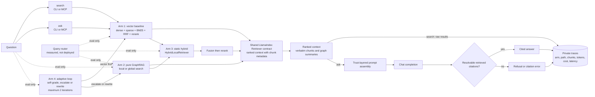

# Retrieval Architecture (Hybrid RAG + GraphRAG)

Expands [`groundly-spec.md`](../groundly-spec.md) §5. This layer is the thesis's scientific core — every design choice must remain measurable and reproducible. Directive on file: **quality over performance** (Paul, 2026-07-15).

## The four arms (evaluation frame)

| Arm | Class | Path | Exists to answer | Status |
|---|---|---|---|---|
| 1. Vector baseline | `VectorRetriever` | dense + sparse + BM25 → RRF → rerank | Strong baseline; NotebookLM-class behavior | **Production arm** (`PRODUCT_ARMS`) |
| 2. Pure GraphRAG | `GraphLocalRetriever`, `GraphGlobalRetriever` | MS `graphrag` local/global search | Does graph structure help multi-hop/global queries? | Eval only (decision 28) |
| 3. Static hybrid | `HybridLocalRetriever` | graph local search → RRF with the baseline | Does cheap routing capture most of the gain? | Eval only (decision 28) |
| 4. Adaptive agentic | `AdaptiveRetriever` (stub) | retrieve → self-grade → escalate/rewrite (≤2 iterations) | Does self-evaluation beat static routing, at what cost? | Declared, not implemented |

**The arms are data, not control flow.** `retrieval/arms.py`'s `ARM_TABLE` is the single inventory — one `Arm` entry per arm, carrying whether it is implemented, ranked, product-selectable and graph-dependent. `ARMS`, `PRODUCT_ARMS` and `UNRANKED_ARMS` are *derived* from it rather than maintained beside it, which is what stops the table and the dispatch from disagreeing. Arm 4 is in the table with no builder: `--arms adaptive` is refused up front as "declared but not implemented" rather than as an unknown arm, and never reaches the eval's per-question error tolerance.

**Arm 3 was the production arm until decision 28; arm 1 is now.** Every arm stays runnable: `ARMS` is what `groundly eval` may score, `PRODUCT_ARMS` is what a user question may reach, and the two being different is the whole content of the decision. Nothing was deleted — the *comparison between the arms is the thesis contribution*, so an arm that loses still has to be re-runnable from shipped code, and each one's cost in quality, money and time is a published result rather than a reason to remove it. Measured tables live in [`docs/thesis/`](../thesis/); the headline is that vector leads hit and recall at every cutoff the product uses, at zero build cost and zero per-query cost, while `hybrid-local` closes most of the MRR gap and overtakes at rank 1 once the graph is built by a capable model.

The common LlamaIndex `Retriever` interface is what makes the comparison fair — same query in, same context format out, per-arm logging (arm, path, chunk ids, tokens, latency, cost) into the local `traces` table in `progress.db`.

## RAG pipeline

The retrieval layer supports vector, graph, hybrid, and adaptive retrieval paths
through one common context contract. `search` returns raw ranked chunks; `ask` adds
trust-layered generation and citation enforcement.

## Components

### Vector baseline (arm 1; the hybrid's workhorse)

Three channels, all derived at index time, fused at query time:

1. **Dense**: bge-m3 (pinned incl. hf_revision), 1024-d, sqlite-vec **brute-force = exact KNN**. This is an accuracy *upgrade* over the archived design's approximate HNSW — at 5k–50k chunks/subject the exact scan costs milliseconds. LanceDB/IVF is the named escape hatch if a corpus ever explodes.
2. **Learned sparse**: bge-m3's sparse lexical weights — same forward pass as dense, stored as an inverted table. Handles Romanian morphology far better than raw tokenization. (bge-m3's ColBERT vectors are **rejected**: ~100× storage would bloat the portable bundle.)
3. **BM25**: SQLite FTS5 over chunk text — free, exact-phrase capable.

Fusion: three-way reciprocal rank fusion. Rerank: `bge-reranker-v2-m3` cross-encoder over the fused top-k, **default ON** (`--no-rerank` for weak hardware); the eval measures its contribution.

**Cross-lingual caveat (stated, not hidden):** only the dense channel matches a Romanian question against English slides; sparse and BM25 are same-language. The eval reports cross-lingual queries as their own slice so the lexical channels aren't misjudged on queries they cannot serve.

Chunking: **Docling HybridChunker** — section-aligned chunks with the heading path ("Lecture 4 › Deadlocks › Prevention") prepended before embedding and stored for citation display; fixed-size windows only for unstructured text.

### Graph backend (arm 2)

MS `graphrag` as a **per-subject batch indexer**: entity/relation extraction → Leiden communities → hierarchical summaries, artifacts as parquet in `graph/`. Rebuild trigger = corpus-hash check inside `groundly index`. Local search (entity-anchored) for multi-hop; global search (community summaries) for synthesis.

- **Extraction cost lands on the student** — a bad graph silently invalidates the comparison. Decision 24 replaced the flat "mid-tier cloud model" rule with a measured floor: roughly 12B, reasoning *verified* off, at `graph.context_window` 12288 ([detail](../guides/graphrag-provider.md)); cloud remains the default recommendation. `groundly index` shows the estimated cost before building; graph build is skippable — the vector baseline works with zero API key.
- Mitigation is the sharing feature: the graph is the most expensive *and* most portable artifact (no embedding coupling) — one student builds, the course imports.
- **Global search is the cost hazard**: map-reduce over community summaries means ~33 LLM calls per query on apd, not one. Since decision 28 it fires from exactly two places — the `overview` tool (UC-12, explicit) and `groundly eval --arms graph-global`. No user question reaches it implicitly, because there is no longer a router that could send one.

### Query router (measured, not deployed)

One cheap LLM call (router call class) labels the query `factoid` / `multi-hop` / `global`. It was arm 3's brain and the economic gate: nothing was supposed to reach token-hungry global search unclassified.

**It is no longer on the ask path** (decision 28). Once `PRODUCT_ARMS` holds one arm, a classifier selecting among one arm is a provider round-trip that cannot change the answer — so the removal follows from the arm retirement and does not depend on how accurate the router was. `agents/router.py` stays as a *measured quantity*: `groundly eval` calls `classify()` directly, and router accuracy remains a reported number in the thesis rather than a live dependency.

The measurement that made this comfortable rather than merely tidy is below — the router sent **30 of 48 questions to `graph-global`**, the arm returning 1,138 chunks at ~33 untraced provider calls each, so the gate was routing the majority of traffic *into* the hazard it existed to prevent.

### Fusion + citation rule

When both backends fire: RRF first, cross-encoder rerank after. Context assembly pairs community summaries (breadth) with verbatim chunks (grounding). **Citations always resolve to verbatim chunks — a community summary is never a citation target** (it has no page).

### Adaptive retrieval (arm 4)

Vector first → LLM self-grades sufficiency → escalate to graph or rewrite the query — hard bound of 2 iterations, then answer with what exists or refuse. A plain bounded async loop (no framework). Eval arm only; a self-grading call on every query is exactly the latency/cost hazard the product path avoids.

## The dual-pipeline confound (honest accounting)

MS `graphrag` runs its own chunking/extraction — the two backends do not share one ingestion pipeline, so an observed difference could partly stem from pipeline differences. Mitigation: align chunk size/overlap and the extraction model where configurable; document the residual difference in the methods section. An examined confound is a methods section; a hidden one is a rejected thesis.

## Evaluation protocol

The harness is `groundly/eval/`, driven by `groundly eval SUBJECT --gold PATH --arms ...` (decision 27). It is a **client-layer** package: it imports the service layer and nothing imports it.

**Selecting an arm.** `retrieve_for_arm(subject, query, arm, ...)` in `retrieval/arms.py` runs exactly one arm and is the eval's only entry point. It lives in `retrieval/` precisely because the eval is retrieval-only: while the dispatch sat next to `ask()`, importing it pulled `llm/chat`, `agents/prompts` and `agents/citations` into a harness that calls none of them (asserted by `tests/test_layering.py`). An unknown arm raises — a typo in `--arms` must never silently score the baseline under another name. `traces` separates `router_label` from `arm`, so nothing in the schema changed.

There is deliberately **no `ask(arm=...)`** (decision 28). It existed so the eval could put one question through every arm, but the eval never used it — it calls `retrieve_for_arm` directly, because that returns candidates without paying for generation. What the parameter actually bought was a live route from a user question into a retired arm, which is what would have made the retirement nominal. Removing it is what makes `PRODUCT_ARMS` true rather than aspirational.

**Gold set** per pilot subject from past exams, stratified by query class (factoid / multi-hop / global synthesis), RO and EN, **cross-lingual queries as a separate slice**. Professor spot-checks. Lives at `evals/<subject>/gold.jsonl`, version-controlled; results are gitignored. apd's is 48 questions (17 factoid / 22 multi-hop / 9 global; 39 EN / 9 RO), drawn from `Examen.md`, the two quiz decks, and hand-written RO items.

- **Labels are `(filename, page)`, never chunk id** — chunk ids are SQLite rowids that shift on re-index; a filename and page survive one. `gold.py` resolves them against the live store at run time and warns (rather than crashing) on a label that no longer matches.
- **The contamination guard is corpus-wide, not per row.** Exam files are themselves indexed, so a question lifted from `Examen.md` retrieves `Examen.md` — a "hit" on the question, not the answer. `expected` may never name **any** file the gold set draws questions from (rejected at load), and `metrics.leakage` reports how often an arm retrieves one regardless, using that same corpus-wide set for every question. Scoping either per row understates contamination: a question can appear verbatim in two indexed files (apd-006 is in both `Examen.md` and `Quiz 2`), and rows with `source_file: null` would report 0.0 by construction — 16 of apd's 48. Measured for the vector arm on apd: **13.5% overall** (factoid 11.0%, multi-hop 17.1%, global 9.7%); 37 of 48 questions retrieve at least one exam chunk.

**Metrics per arm × class × language.** Retrieval hit rate, recall, MRR, leakage, retrieved-set size, latency (slice 1, offline). RAGAS groundedness/faithfulness, citation accuracy, router accuracy and cost from the traces table (slice 2, needs a provider).

- **Set size is not optional.** Arms do not return comparable numbers of chunks: the vector arm returns `context_k` (8), while `graph-global` measured **1,138 of apd's 1,193 chunks — 95% of the corpus — for every question**. Its recall of 1.00 and hit rate of 100% are artifacts of returning nearly everything. `retrieved_n` is what exposes that, and hit-rate/recall comparisons across arms are invalid without it beside them; the CLI warns when arms differ by more than 4x. This is the global-citation-join open risk above, measured.
- **Rank metrics are withheld from arms that have no rank.** `graph-global` ends its citation join with `sorted(chunk_ids)` — ascending SQLite rowid, i.e. the order chunks happened to be indexed in. An MRR over that measures corpus layout, not retrieval, and it is deterministic from the parquet files without a single LLM call. Arms marked `ranked=False` in `ARM_TABLE` therefore report `mrr = None` (rendered `—`) rather than a number that invites interpretation. An earlier draft of this document cited graph-global's MRR of 0.02 as evidence that its recall was hollow; the recall *is* hollow, but `retrieved_n` shows it and MRR never did. Order-insensitive metrics (hit rate, recall, leakage) stay valid for these arms.
- **Errors are excluded, not counted as misses.** A provider outage or context overflow is recorded per question and reported; folding it into hit rate would read as an arm retrieving badly.
- **The headline comparison is set-size-matched (`--at-k`).** `retrieve_for_arm` returns each arm's *full* candidate list and the consumer applies `context_k`, so one sweep scores every cutoff — `metrics.sweep` re-cuts the stored rows offline. Default cutoffs are **1, 5, 8, 10, 20**; 20 is the vector arm's honest ceiling, because `RERANK_POOL` caps the pool the cross-encoder ever sees and a longer list would mix reranked with un-reranked positions. **There is no such thing as `vector@32`.** Comparing an 8-chunk arm against a 33-chunk one and reading the difference as quality is the mistake this table exists to prevent.
- **Leakage is read against the corpus base rate, never raw.** Question-source material is **45 of apd's 1,193 chunks (3.77%)**, so an arm returning 95% of the corpus scores ≈ the base rate by construction and *looks cleanest* while telling you nothing. The results document carries `leakage_base_rate` and the CLI reports `leakage / base_rate`: 1.0x is no signal, and the vector arm's 13.5% is a **3.6x enrichment** — real contamination. Same set-size confound `retrieved_n` guards for hit rate and recall.
- **A per-question delta is not a result until it survives a paired test, run at a matched cutoff.** Arms see identical questions, so `metrics.mcnemar` runs an exact two-sided McNemar against the `vector` baseline — **at each `--at-k` cutoff, never at the arms' natural set sizes**, because testing a 42-chunk arm against a 20-chunk one re-imports the confound the matched table exists to remove. Measured on apd this is not academic: unmatched, `hybrid-local` reads as marginally *ahead* (1 win, 0 losses, p = 1.000); matched, `vector` leads at every cutoff (k=1: 5-2, k=5: 8-5, k=8: 8-3, k=10: 4-3, k=20: 4-0). At n = 48 **none of them clears p < 0.05** (best is k=20 at p = 0.125; 8-vs-1 is the first split that would). The consistent direction across cutoffs is worth reporting descriptively; the cutoffs are nested over the same questions, so they must not be combined into one p-value.
- **Rows store their own labels.** `Scored.expected` keeps the resolved gold chunk ids, so a finished results file is re-scorable without the index that produced it — a re-index shifts every rowid underneath it, and re-deriving labels from a live store is how the first truncation analysis had to be done.

**Provider requirements are asymmetric — but only `graph-global` still needs a provider at all.** `vector` is genuinely zero-key, and `hybrid-local` now is too.

- `hybrid-local`: **zero-key.** graphrag's `local_search` builds its entire context, hands it to `on_context`, and only then streams a prose answer that Groundly discards (`ask()` writes its own, through `llm/`, where it is traced). `retrieval/graph.py`'s `_AbortAfterContext` raises out of that callback, so the arm never reaches a completion model. Measured on apd: **33–49x faster, chunk ids byte-identical on every question tested** (152–208 s → 3.6–6.2 s with a 12B model resident; 0.21–0.45 s for the graph half on an idle machine). This also closes the untraced-call gap for this arm and satisfies the zero-key rule in `.claude/rules/architecture.md`. The arm still returns a placeholder completion config because graphrag validates one — it is never called.
- `graph-global`: **map-reduce over the community summaries**, batched to `GlobalSearchConfig.max_context_tokens` (12,000, unoverridden), so call count scales with total report volume. Measured on apd — 555 reports at `level <= 2`, ~389k tokens — that is **~33 map calls + 1 reduce per question**; a 48-question sweep is ~1,600 untraced provider calls, not 48. No equivalent abort exists: `on_context` fires *after* the map phase (`GlobalSearch.stream_search`), so the reports the citation join needs are only available once the expensive work is already done. The query path now also passes `concurrent_requests` (it defaulted to graphrag's 25 against a loopback provider, the exact shared-KV-cache failure the build path has always avoided).

**Latency is only comparable within a single-arm run.** A resident local model slows every other arm on the same machine — the vector arm measured 5.6 s standalone and 30.5 s interleaved with graph arms in one sweep, a 5.4x penalty that is contention, not retrieval. The results document records `latency_comparable`, and the CLI says so when more than one arm ran. Cross-arm latencies from a mixed sweep do not belong in the thesis.

- **Grounding-fidelity experiment:** the same gold questions answered (a) through the enforced `ask` pipeline and (b) host-composed from raw `search` results — compared on faithfulness + citation accuracy. Measures enforced vs agent-mediated grounding, the design's biggest real-world tension.
- **Reproducibility:** a frozen `~/.groundly/<SUBJECT>/` directory is the experimental artifact — hashable, shippable with the thesis; all four arms re-runnable anywhere.
- Expected result shape: per-class deltas ("hybrid matches the baseline on factoids at ~equal cost; improves multi-hop by X% at Y% cost"). GraphRAG is timeboxed; a negative result is a finding, not a failure.

**First measured baseline** (vector arm, apd, 48 questions, 2026-08-03): hit rate 94% factoid / 59% multi-hop / 56% global; recall 0.76 / 0.39 / 0.22; MRR 0.49 / 0.30 / 0.17. The degradation from factoid to multi-hop and global is the gap the graph arms exist to close.

**First fair arm comparison** (apd, 48 questions, 2026-08-08, both arms zero-key, matched cutoffs):

| k | `hybrid-local` hit / recall / MRR | `vector` hit / recall / MRR |
|---|---|---|
| 1 | 8% / 0.04 / 0.08 | **15% / 0.09 / 0.15** |
| 5 | 54% / 0.31 / 0.25 | **60% / 0.41 / 0.32** |
| 8 | 60% / 0.38 / 0.26 | **71% / 0.49 / 0.34** |
| 10 | 69% / 0.48 / 0.27 | **71% / 0.52 / 0.34** |
| 20 | 81% / 0.61 / 0.28 | **90% / 0.64 / 0.35** |

**The baseline wins at every cutoff on every metric.** At the arms' natural set sizes the same run reads the other way (`hybrid-local` 92% hit / 0.71 recall against 90% / 0.64) purely because it returns 42 chunks to the vector arm's 20 — the set-size artifact in its clearest form, and the reason the unmatched table is no longer the headline. Fusing a graph arm into the baseline does not improve retrieval on this corpus; it dilutes the ranking (MRR 0.28 against 0.35) while adding a 15-hour build.

**Contamination is concentrated at the top of the ranking**, which raw leakage hides: at k=1 the vector arm's retrieved chunk is question-source material at **14.9x** the corpus base rate, falling to 2.5x by k=20. The single chunk a student is most likely to read is the one most likely to be an exam question rather than the material answering it — a finding for the methods section, and the argument for the contamination-control re-index.

**Router accuracy (apd, 48 questions, `gemma-4-12b-qat`, 2026-08-08): 47.9%** — against 45.8% for a constant classifier that always answers "multi-hop". The router beats guessing by **one question**. The confusion is not noise but a single systematic bias:

> **Provenance caveat, load-bearing:** this figure is a *local 12B* measurement. A re-measurement on the cloud provider (`gpt-oss-120b`) was taken and **retracted** — `[providers.router]` sets neither `temperature` nor `reasoning_effort`, and `llm/chat.py` only sends those when configured, so the run classified at provider-default reasoning and temperature and varied by 19 points between repeats. Router accuracy on the current configuration is therefore **unmeasured**, and this number must be cited with its model attached. It is not what decision 28 rests on: with one arm in `PRODUCT_ARMS`, a classifier has nothing to select regardless of how accurate it is.

| gold \ routed | factoid | multi-hop | global |
|---|---|---|---|
| factoid (17) | 8 | 3 | **6** |
| multi-hop (22) | 1 | 6 | **15** |
| global (9) | 0 | 0 | 9 |

**30 of 48 questions (62.5%) are routed to `global`**, a class holding 9 of them (18.8%) — perfect recall, 30% precision. That sends the majority of traffic to the arm that returns 1,138 chunks and costs ~33 untraced provider calls per question, and it means the `assemble()` overflow above was not an edge case: **before the cap, 30 of 48 questions on the product path would have pushed ~183k tokens into a 16,384-token window.** The oracle-vs-baseline headroom is meanwhile only 77.1% against 70.8% at k=8 — three questions, well inside the ~9 this gold set can resolve. On this corpus the routing layer cannot pay for itself, and the honest configuration is vector-only until either the router or the graph arms improve.
