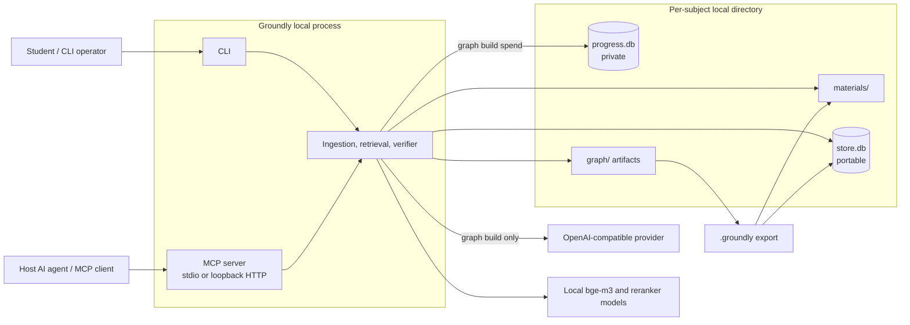
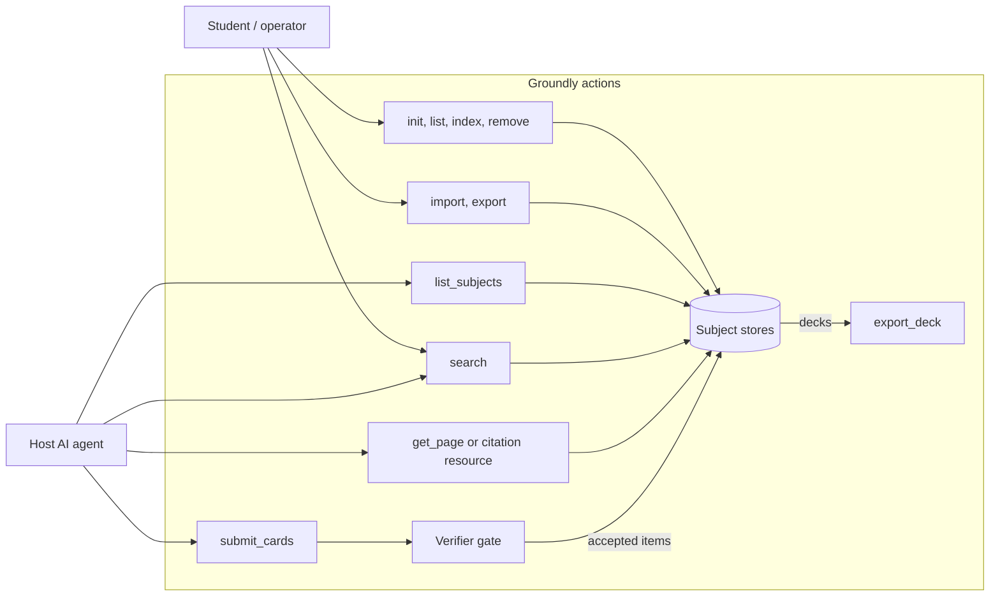

# Simplify to MCP-first, Zero-key — Implementation Plan

> **For agentic workers:** REQUIRED SUB-SKILL: Use superpowers:subagent-driven-development (recommended) or superpowers:executing-plans to implement this plan task-by-task. Steps use checkbox (`- [ ]`) syntax for tracking.

**Goal:** Remove the research stack, the enforced `ask` pipeline, thick generation, query-time graph search and LlamaIndex from `main`, leaving a zero-key MCP product (search + verified cards + sharing) plus a graph *build* kept for the topic map.

**Architecture:** Deletion in dependency order, one commit per concern, every commit green. The MCP `search` wire payload and the `groundly search` output stay byte-identical; the interchange format (manifest, `store.db` schema) does not change. Docs and code prose are rewritten last so the behavioural commits stay reviewable.

**Tech Stack:** Python 3.12 (`.venv/bin/python`), pytest, ruff, typer, FastMCP, SQLite + sqlite-vec, graphrag 3.1.0 (build only), uv.

**Spec:** [docs/superpowers/specs/2026-09-11-simplify-mcp-first-design.md](../specs/2026-09-11-simplify-mcp-first-design.md)

## Global Constraints

- Branch `simplify-mcp-first`; never commit to `main`; never push a branch or tag without Paul's explicit confirmation.
- Run Python only as `.venv/bin/python` (no bare `python` on PATH); use repo-root-relative paths, never `cd` (zoxide breaks it).
- Every commit: `.venv/bin/python -m pytest -q` green (slow tests deselected by default), `.venv/bin/ruff check .` and `.venv/bin/ruff format --check .` clean. Baseline on `main`: 715 passed, 24 deselected.
- The Edit hook runs `ruff --fix` after every Python edit and strips imports that look unused: change bodies first, add imports last.
- The repo strips trailing whitespace; no file may rely on trailing spaces.
- Interchange: no manifest field change, no `format_version` bump, no `store.db` `user_version` bump.
- The MCP `search` payload keys stay exactly `chunk_id, text, score, filename, page, heading_path, uri`.
- Everything except `groundly index --graph` works with no `config.toml`.
- MCP tool docstrings, `SERVER_INSTRUCTIONS` and typer command docstrings are product text (tool descriptions / CLI help); change them only where a task says so.
- Every commit message ends with `Co-Authored-By: Claude Opus 5 <noreply@anthropic.com>`.

**Commit map:** the spec's C0–C6. C2 is split into C2a (answer paths + research surface) and C2b (single provider), and C5 into C5a/C5b/C5c, so each stays reviewable on its own.

## File map

| Path | Fate | Task |
|---|---|---|
| `groundly/agents/jobs.py`, `tests/agents/test_jobs.py` | delete | 1 |
| `groundly/agents/{ask,citations,prompts,tracing,probe,router,study_modes}.py` | delete | 2 |
| `groundly/eval/` (7 files), `groundly/cli/eval.py`, `groundly/cli/eval_grounding.py`, `groundly/web/` | delete | 2 |
| `groundly/retrieval/{arms,graph,adaptive}.py` | delete | 2 |
| `groundly/retrieval/nodes.py` | replaced by `retrieval/hits.py` | 4 |
| `groundly/cli/ask.py` | `git mv` → `groundly/cli/search.py` | 2 |
| `groundly/agents/decks.py`, `groundly/mcp/server.py` | trim | 1, 2, 4 |
| `groundly/retrieval/vector.py` | trim, then rewrite | 2, 4 |
| `groundly/core/progress.py`, `groundly/cli/models.py`, `groundly/cli/__init__.py` | trim | 2, 3 |
| `groundly/core/config.py`, `groundly/llm/{chat,graphrag_adapter,graph_cost}.py`, `groundly/ingestion/graph.py`, `groundly/cli/cost_display.py`, `groundly/core/manifest.py` | single provider | 3 |
| `groundly/agents/verifier.py`, `groundly/cli/search.py` | read `Hit` fields | 4 |
| `pyproject.toml`, `uv.lock`, `.claude/hooks/guard-pins.sh` | deps | 5 |
| `docs/**`, `README.md`, `.claude/**`, `CLAUDE.md` | rewrite | 6–8 |
| every surviving `groundly/**/*.py` | comments/docstrings only | 9 |

---

### Task 0: Tag the research stack (C0)

**Files:** none (git metadata only).

- [ ] **Step 1: Create the annotated tag on main's head**

```bash
git tag -a thesis-experiments-2026-09 3f4cda8 -m "Research stack as measured for the thesis: eval harnesses, gold sets, graph retrieval arms, router, enforced ask, thick generation. Removed from main by simplify-mcp-first."
```

- [ ] **Step 2: Verify it points at the right commit**

Run: `git log -1 --format='%h %s' thesis-experiments-2026-09`
Expected: `3f4cda8 \`[providers.chat]\` gets a floor, and a probe that measures it (#35)`

- [ ] **Step 3: Do not push.** Pushing the tag happens in Task 10, only after Paul confirms.

---

### Task 1: Thick generation out (C1)

**Files:**
- Delete: `groundly/agents/jobs.py`, `tests/agents/test_jobs.py`
- Modify: `groundly/agents/decks.py` (whole file), `groundly/agents/prompts.py`, `groundly/mcp/server.py`, `groundly/core/config.py:29-43`
- Test: `tests/agents/test_decks.py`, `tests/mcp/test_mcp_server.py`

**Interfaces:**
- Produces: `groundly.agents.decks` exposes only `MAX_COUNT: int = 50`, `CardOutcome`, `submit_cards(subject, deck, cards, *, generation_source, embedder=None) -> list[CardOutcome]`.

- [ ] **Step 1: Remove the thick-path tests**

In `tests/agents/test_decks.py`, delete everything from the line `# --- thick door: generate_deck_job ---…` to the end of the file (the `GOOD_CARD`/`BAD_CARD`/`FIXED_CARD` constants, every `test_thick_loop_*` test and both `test_estimate_generation_*` tests).

In `tests/mcp/test_mcp_server.py`, delete these three tests:
`test_generate_deck_without_confirm_returns_estimate_and_starts_nothing`,
`test_generate_deck_confirm_without_provider_fails_with_specific_message`,
`test_get_job_unknown_id_errors_with_session_scope_explanation`,
and change the section comment `# --- generate_deck / get_job / list_decks (thick door) ---…` to `# --- list_decks ---…` (keep the dash padding).

Run: `git rm -q tests/agents/test_jobs.py`

- [ ] **Step 2: Replace `groundly/agents/decks.py` with the thin door only**

```python
"""Deck building through the one verifier gate (docs/architecture/agents.md): host-written
cards are verified and the ones that pass are stored. Rejected cards store nothing; every
verdict is recorded in progress.db."""

from dataclasses import dataclass

from groundly.agents.verifier import CardCandidate, Rejection, verify_card
from groundly.core.progress import connect_progress, record_verification
from groundly.core.store import SubjectStore
from groundly.core.subject import Subject

MAX_COUNT = 50  # cards per submit_cards call


@dataclass
class CardOutcome:
    index: int
    accepted: bool
    question_id: int | None = None
    rejection: Rejection | None = None


def submit_cards(
    subject: str,
    deck: str,
    cards: list[CardCandidate],
    *,
    generation_source: str,
    embedder=None,
) -> list[CardOutcome]:
    """Verify every card and store the ones that pass into `deck`. Zero-key: the
    verifier touches only local bge-m3 (lazily), never a provider."""
    subj = Subject(subject)
    store = SubjectStore(subj.store_db_path)
    deck_id = store.get_or_create_deck(deck)
    progress_conn = connect_progress(subj.progress_db_path)

    outcomes: list[CardOutcome] = []
    try:
        for i, card in enumerate(cards):
            rejection = verify_card(card, store, embedder=embedder)
            if rejection is None:
                question_id = store.add_verified_card(
                    deck_id, card.front, card.back, card.chunk_ids, generation_source
                )
                outcomes.append(CardOutcome(index=i, accepted=True, question_id=question_id))
            else:
                outcomes.append(CardOutcome(index=i, accepted=False, rejection=rejection))
            record_verification(
                progress_conn,
                generation_source=generation_source,
                reason=None if rejection is None else rejection.reason,
            )
    finally:
        progress_conn.close()
    return outcomes
```

Then: `git rm -q groundly/agents/jobs.py`

- [ ] **Step 3: Remove the card prompts from `groundly/agents/prompts.py`**

Delete `CARD_SYSTEM_RULES`, `assemble_cards` and `assemble_cards_retry` (the whole block between `assemble` and `assemble_overview`). In `_render_chunks`'s docstring replace
`one guard covering \`assemble\`, \`assemble_cards\`,\n    \`assemble_cards_retry\` and \`assemble_overview\` rather than four that can drift apart.`
with
`one guard covering \`assemble\` and \`assemble_overview\`.`
(The whole module is deleted in Task 2; this keeps C1 self-consistent.)

- [ ] **Step 4: Remove the thick MCP tools from `groundly/mcp/server.py`**

Delete the `generate_deck` and `get_job` tool functions, each with its `@mcp.tool` decorator. In `list_decks`'s docstring replace
``deck names are what\n    `submit_cards`/`generate_deck` write into and `export_deck` reads from.``
with
``deck names are what\n    `submit_cards` writes into and `export_deck` reads from.``

- [ ] **Step 5: Drop the `generation` call class in `groundly/core/config.py`**

```python
CALL_CLASSES = ("chat", "extraction", "router", "judge")
```

and delete the `"generation": "exam/deck generation (thick path)",` entry from `_PROVIDER_COMMENTS`.

- [ ] **Step 6: Verify nothing still references the thick path**

Run: `grep -rnE "generate_deck|get_job|estimate_generation|assemble_cards|agents\.jobs|\"generation\"" groundly tests`
Expected: no output.

Run: `.venv/bin/python -m pytest -q && .venv/bin/ruff check . && .venv/bin/ruff format --check .`
Expected: all pass (~700 passed).

- [ ] **Step 7: Commit**

```bash
git add -A groundly tests
git commit -q -F - <<'EOF'
Remove thick generation: the host writes cards, Groundly verifies (C1)

generate_deck/get_job, the job registry, the card prompts and the
generation call class go. submit_cards is the only door into a deck.

Co-Authored-By: Claude Opus 5 <noreply@anthropic.com>
EOF
```

---

### Task 2: Answer paths and research surface out (C2a)

**Files:**
- Delete: `groundly/eval/` (whole package), `groundly/cli/eval.py`, `groundly/cli/eval_grounding.py`, `groundly/agents/{ask,citations,prompts,tracing,probe,router,study_modes}.py`, `groundly/retrieval/{arms,graph,adaptive}.py`, `groundly/web/`, `evals/*/gold.jsonl`
- Delete (tests): `tests/eval/`, `tests/cli/test_cli_eval.py`, `tests/cli/test_cli_eval_grounding.py`, `tests/agents/{test_agents_ask,test_agents_router,test_agents_study_modes,test_agents_prompts,test_citations,test_probe}.py`, `tests/retrieval/{test_arms,test_retrieval_graph,test_retrieval_stubs}.py`
- Rename: `groundly/cli/ask.py` → `groundly/cli/search.py`; `tests/cli/test_cli_ask.py` → `tests/cli/test_cli_search.py`
- Modify: `groundly/mcp/server.py`, `groundly/cli/__init__.py`, `groundly/cli/models.py`, `groundly/retrieval/vector.py`, `groundly/agents/decks.py`, `groundly/core/progress.py`
- Test: `tests/mcp/test_mcp_server.py`, `tests/retrieval/test_retrieval_vector.py`, `tests/agents/{test_decks,test_verifier}.py`, `tests/cli/{test_cli_models,test_cli_subjects}.py`, `tests/ingestion/test_ingestion_graph.py`, `tests/test_layering.py`, `tests/conftest.py`

**Interfaces:**
- Produces: MCP surface is exactly `list_subjects`, `search`, `get_page`, `submit_cards`, `list_decks`, `export_deck` plus the `groundly://{subject}/{filename}` resource template.
- Produces: `groundly.retrieval.vector.search(subject, query, *, k=None, rerank=None, embedder=None, reranker=None)` returns ranked nodes and writes nothing.
- Produces: `groundly.core.progress` exposes only `create_progress`, `connect_progress`, `record_trace`.

- [ ] **Step 1: Write the failing surface test**

Append to `tests/mcp/test_mcp_server.py`, directly after `test_search_description_leads_with_when_to_use_not_retrieval_mechanics`:

```python
async def test_the_tool_surface_is_exactly_these_seven_entries():
    """The surface is UX (.claude/rules/conventions.md). A tool that creeps back in —
    or one quietly dropped — should fail here rather than in a host months later."""
    async with Client(mcp) as client:
        tools = {t.name for t in await client.list_tools()}
        templates = {t.uriTemplate for t in await client.list_resource_templates()}
    assert tools == {
        "list_subjects",
        "search",
        "get_page",
        "submit_cards",
        "list_decks",
        "export_deck",
    }
    assert templates == {"groundly://{subject}/{filename}"}
```

- [ ] **Step 2: Write the failing "search writes nothing" test**

In `tests/retrieval/test_retrieval_vector.py`, replace `test_search_returns_nodes_and_records_trace` with:

```python
def test_search_returns_ranked_nodes_and_writes_no_trace(retrievable_subject):
    """search is read-only: every query the student asks used to land in progress.db,
    and nothing reads those rows any more."""
    from groundly.core.progress import connect_progress

    nodes = search(retrievable_subject, "deadlock", embedder=_near_embedder(), rerank=False)
    assert nodes and len(nodes) <= CONTEXT_K

    conn = connect_progress(subject_dir(retrievable_subject) / "progress.db")
    try:
        assert conn.execute("SELECT COUNT(*) FROM traces").fetchone()[0] == 0
    finally:
        conn.close()
```

Delete the now-unused `connect` import from that file's header (`from groundly.core.store import SubjectStore, connect` → `from groundly.core.store import SubjectStore`).

- [ ] **Step 3: Run both to verify they fail**

Run: `.venv/bin/python -m pytest tests/mcp/test_mcp_server.py::test_the_tool_surface_is_exactly_these_seven_entries tests/retrieval/test_retrieval_vector.py::test_search_returns_ranked_nodes_and_writes_no_trace -q`
Expected: 2 failed — the surface still carries `ask`/`drill_down`/`overview`, and `search` still writes one trace row.

- [ ] **Step 4: Delete the modules**

```bash
git rm -rq groundly/eval groundly/web tests/eval
git rm -q groundly/cli/eval.py groundly/cli/eval_grounding.py
git rm -q groundly/agents/ask.py groundly/agents/citations.py groundly/agents/prompts.py \
          groundly/agents/tracing.py groundly/agents/probe.py groundly/agents/router.py \
          groundly/agents/study_modes.py
git rm -q groundly/retrieval/arms.py groundly/retrieval/graph.py groundly/retrieval/adaptive.py
git rm -q evals/apd/gold.jsonl evals/gm-validate/gold.jsonl evals/passc/gold.jsonl
git rm -q tests/cli/test_cli_eval.py tests/cli/test_cli_eval_grounding.py \
          tests/agents/test_agents_ask.py tests/agents/test_agents_router.py \
          tests/agents/test_agents_study_modes.py tests/agents/test_agents_prompts.py \
          tests/agents/test_citations.py tests/agents/test_probe.py \
          tests/retrieval/test_arms.py tests/retrieval/test_retrieval_graph.py \
          tests/retrieval/test_retrieval_stubs.py
```

- [ ] **Step 5: Trim `groundly/mcp/server.py`**

Delete, each with its decorator: the `ask`, `drill_down` and `overview` tools, and the helpers `_answer_payload` and `_maps_service_errors`. Delete `import functools`.

Replace the module docstring's first sentence:

```python
"""The MCP tool surface: `list_subjects`, `search`, `get_page`, `submit_cards`,
`list_decks`, `export_deck`, plus a citation resource template — thin wrappers over the
same functions the `groundly` CLI verbs call.
No heavy imports at module top: service imports live inside tool/resource bodies so
host spawn -> handshake is fast and bge-m3/torch load lazily on first `search`
(.claude/rules/architecture.md).
"""
```

In `list_subjects`'s docstring replace `valid subject\n    names for search/ask/get_page.` with `valid subject\n    names for search/get_page.`

- [ ] **Step 6: Rename the CLI verb module and keep only `search`**

Run: `git mv groundly/cli/ask.py groundly/cli/search.py`

Then replace the file's header (everything above `@app.command()` for `search`) and delete the `ask` command, leaving:

```python
"""`groundly search`: raw retrieval from the terminal — the same function the MCP
`search` tool calls. No LLM call, no provider needed."""

from typing import Annotated

import typer
from rich.markup import escape

from groundly.cli.app import _fail, _store_checked, _subject_checked, app, console
```

Keep the `search` command exactly as it is (signature, docstring and body unchanged).

- [ ] **Step 7: Update `groundly/cli/__init__.py`**

```python
"""Groundly CLI — batch lifecycle verbs; the host agent is the interactive surface."""

from groundly.cli import (  # noqa: F401  registers verbs on `app`
    decks,
    graph,
    mcp,
    models,
    search,
    serve,
    sharing,
    subjects,
)
from groundly.cli.app import app

__all__ = ["app"]
```

- [ ] **Step 8: Delete `config check`**

In `groundly/cli/models.py`, delete the whole `config_check` function together with its `@config_app.command(name="check")` decorator.

- [ ] **Step 9: Trim `groundly/retrieval/vector.py`**

Delete the entire `HybridLocalRetriever` class. Replace `search()` with:

```python
def search(
    subject: str,
    query: str,
    *,
    k: int | None = None,
    rerank: bool | None = None,
    embedder=None,
    reranker=None,
) -> list[NodeWithScore]:
    """The raw retrieval path: query -> ranked chunks, no LLM call, no provider needed.
    Shared by `groundly search` and the MCP `search` tool."""
    from groundly.core.subject import Subject

    store = SubjectStore(Subject(subject).store_db_path)
    retriever = VectorRetriever(
        store, embedder=embedder, reranker=reranker, rerank=rerank, context_k=k
    )
    return retriever.retrieve(query)
```

Then fix the header: `import time` goes, and the import becomes `from groundly.retrieval.nodes import node_from_row`. Replace the module docstring with:

```python
"""The vector retriever: bge-m3 dense + learned sparse + BM25, fused by reciprocal rank
fusion, then an optional cross-encoder rerank. `search()` is the zero-key shared function
behind `groundly search` and the MCP `search` tool."""
```

- [ ] **Step 10: Stop recording verifier verdicts in `groundly/agents/decks.py`**

Replace the file's `submit_cards` (and its imports) so nothing touches `progress.db`:

```python
"""Deck building through the one verifier gate (docs/architecture/agents.md): host-written
cards are verified and the ones that pass are stored. Rejected cards store nothing."""

from dataclasses import dataclass

from groundly.agents.verifier import CardCandidate, Rejection, verify_card
from groundly.core.store import SubjectStore
from groundly.core.subject import Subject

MAX_COUNT = 50  # cards per submit_cards call


@dataclass
class CardOutcome:
    index: int
    accepted: bool
    question_id: int | None = None
    rejection: Rejection | None = None


def submit_cards(
    subject: str,
    deck: str,
    cards: list[CardCandidate],
    *,
    generation_source: str,
    embedder=None,
) -> list[CardOutcome]:
    """Verify every card and store the ones that pass into `deck`. Zero-key: the
    verifier touches only local bge-m3 (lazily), never a provider."""
    store = SubjectStore(Subject(subject).store_db_path)
    deck_id = store.get_or_create_deck(deck)

    outcomes: list[CardOutcome] = []
    for i, card in enumerate(cards):
        rejection = verify_card(card, store, embedder=embedder)
        if rejection is None:
            question_id = store.add_verified_card(
                deck_id, card.front, card.back, card.chunk_ids, generation_source
            )
            outcomes.append(CardOutcome(index=i, accepted=True, question_id=question_id))
        else:
            outcomes.append(CardOutcome(index=i, accepted=False, rejection=rejection))
    return outcomes
```

- [ ] **Step 11: Remove the orphaned `progress.py` helpers**

In `groundly/core/progress.py` delete `max_trace_id`, `read_traces`, `record_verification`, the `_VERIFICATIONS_SCHEMA` constant and its `conn.executescript(_VERIFICATIONS_SCHEMA)` line in `connect_progress`. An existing `progress.db` keeps its `verifications` table; new ones simply never get one. Replace `connect_progress`'s docstring with:

```python
    """Open progress.db, creating it (and the traces table) if missing. `CREATE TABLE IF
    NOT EXISTS` idempotently upgrades an older progress.db with no migration framework —
    progress.db never travels, so this is safe."""
```

Update the module docstring's first line to `"""progress.db access — the graph build's spend trace."""` and keep the "Never exported" paragraph exactly as it is.

- [ ] **Step 12: Update the remaining tests**

`tests/test_layering.py` — replace the whole file:

```python
"""Module-boundary invariant no other test would notice breaking
(.claude/rules/architecture.md): clients (`cli/`, `mcp/`) -> services (`agents/`,
`retrieval/`, `ingestion/`) -> foundations (`llm/`, `core/`), and nothing imports the
client layer. Checked by reading imports rather than by importing, so a violation is
reported as a named boundary breach instead of an ImportError."""

import ast
from pathlib import Path

_PACKAGE = Path(__file__).resolve().parents[1] / "groundly"
_CLIENTS = ("cli", "mcp")


def _imported_modules(path: Path) -> set[str]:
    """Every `groundly.*` module named by an import in `path`, at any nesting depth —
    function-local imports are how this codebase defers heavy dependencies, so a
    top-level-only scan would miss most of them."""
    tree = ast.parse(path.read_text(encoding="utf-8"), filename=str(path))
    found: set[str] = set()
    for node in ast.walk(tree):
        if isinstance(node, ast.Import):
            found.update(a.name for a in node.names if a.name.startswith("groundly."))
        elif isinstance(node, ast.ImportFrom) and node.level == 0 and node.module:
            if node.module.startswith("groundly."):
                found.add(node.module)
    return found


def test_nothing_imports_the_client_layer():
    """A service or foundation reaching back into `cli/` or `mcp/` inverts the stack."""
    offenders: dict[str, list[str]] = {}
    for path in sorted(_PACKAGE.rglob("*.py")):
        rel = path.relative_to(_PACKAGE).as_posix()
        if rel.split("/")[0] in _CLIENTS:
            continue  # a client may import its own layer
        bad = sorted(
            m for m in _imported_modules(path) if m.split(".")[1:2] and m.split(".")[1] in _CLIENTS
        )
        if bad:
            offenders[rel] = bad
    assert not offenders, f"non-client modules importing the client layer: {offenders}"
```

`tests/cli/test_cli_ask.py` → `git mv tests/cli/test_cli_ask.py tests/cli/test_cli_search.py`, then replace the whole file:

```python
"""CLI: the `search` verb (raw retrieval, zero-key)."""

from typer.testing import CliRunner

from groundly.cli import app

runner = CliRunner()


def test_search_works_with_no_config(retrievable_subject, monkeypatch, stub_embedder):
    """UC-02: no config.toml anywhere in this test's GROUNDLY_HOME."""
    monkeypatch.setattr("groundly.llm.embeddings.BgeM3Embedder", stub_embedder)
    result = runner.invoke(app, ["search", retrievable_subject, "deadlock", "--no-rerank"])
    assert result.exit_code == 0, result.output
    assert "lec.pdf" in result.output


def test_search_no_rerank_plumbs_through(retrievable_subject, monkeypatch):
    captured = {}

    def fake_search(subject, query, *, k=8, rerank=True, embedder=None, reranker=None):
        captured["rerank"] = rerank
        return []

    monkeypatch.setattr("groundly.retrieval.vector.search", fake_search)
    result = runner.invoke(app, ["search", retrievable_subject, "deadlock", "--no-rerank"])
    assert result.exit_code == 0, result.output
    assert captured["rerank"] is False


def test_search_model_download_error_fails_cleanly(retrievable_subject, monkeypatch):
    from groundly.llm.embeddings import ModelDownloadError

    def fake_search(*a, **k):
        raise ModelDownloadError("failed to load bge-m3: boom")

    monkeypatch.setattr("groundly.retrieval.vector.search", fake_search)
    result = runner.invoke(app, ["search", retrievable_subject, "deadlock"])
    assert result.exit_code == 1
    assert "failed to load bge-m3" in result.output


def test_search_uninitialized_subject_fails_with_fix(tmp_path, monkeypatch):
    monkeypatch.setenv("GROUNDLY_HOME", str(tmp_path / "home"))
    (tmp_path / "home").mkdir()
    result = runner.invoke(app, ["search", "NOPE", "q"])
    assert result.exit_code == 1
    assert "groundly init NOPE" in result.output
```

`tests/mcp/test_mcp_server.py` — delete the helper `_configure_chat`, the classes `_FakeGraphLocalRetriever` and `_FakeGraphGlobalRetriever`, every `test_ask_*` test, `test_mcp_ask_matches_cli_ask_for_the_same_query`, every `test_drill_down_*` and `test_overview_*` test, and the `# --- ask ---`, `# --- drill_down / overview ---` section comments. Keep `test_search_model_download_error_raises_tool_error`. Update the module docstring's first line to `"""groundly/mcp/server.py: the FastMCP tool surface (list_subjects/search/get_page/`
`submit_cards/list_decks/export_deck + citation resource)."""`

`tests/agents/test_decks.py` — delete `test_every_verdict_recorded_in_verifications` and the `from groundly.core.progress import connect_progress` import; change the module docstring to:

```python
"""The thin door: `submit_cards` is the single gate into a deck — accepted cards land in
store.db with their generation source, rejected cards store nothing and come back with a
machine-readable rejection."""
```

`tests/agents/test_verifier.py` — delete `test_no_search_trace_written_by_verification` (the traces it guarded are gone).

`tests/cli/test_cli_models.py` — delete `_configure_chat`, `_stub_probe` and the three `test_config_check_*` tests.

`tests/cli/test_cli_subjects.py` — in the `test_bad_usage_is_usage_error` parametrize list, replace `["ask", "PDSS"],  # query required` with `["search", "PDSS"],  # query required`.

`tests/ingestion/test_ingestion_graph.py` — in `test_refused_build_is_not_served_by_the_query_path`: rename it to `test_refused_build_is_not_reported_as_built`, delete the `from groundly.retrieval.graph import ...` import, and replace the final two lines

```python
    assert (subj.root_dir / "graph" / "entities.parquet").exists()  # left for the retry
    with pytest.raises(GraphNotBuiltError):
        GraphLocalRetriever(subject=subj.name).retrieve("anything")
```

with

```python
    assert (subj.root_dir / "graph" / "entities.parquet").exists()  # left for the retry
    assert not subj.graph_is_built()  # the manifest decides, not the directory
```

and adjust its docstring to end `… — otherwise a graph missing most of the corpus is reported as built.`

- [ ] **Step 13: Drop the now-unused chat stub**

Run: `grep -rn "stub_chat\|StubChat" tests`
If the only hits are in `tests/conftest.py`, delete the `StubChat` class and the `stub_chat` fixture from it. If any test still uses it, leave both alone.

- [ ] **Step 14: Run the suite**

Run: `.venv/bin/python -m pytest -q && .venv/bin/ruff check . && .venv/bin/ruff format --check .`
Expected: green, roughly 480–500 passed.

- [ ] **Step 15: Verify nothing references the deleted modules**

Run: `grep -rnE "agents\.(ask|citations|prompts|tracing|probe|router|study_modes)|retrieval\.(arms|graph|adaptive)|groundly\.eval|drill_down|overview|NoCitationsError|GraphNotBuiltError|read_traces|max_trace_id|record_verification|HybridLocal" groundly tests`
Expected: no output.

- [ ] **Step 16: Commit**

```bash
git add -A
git commit -q -F - <<'EOF'
Remove the answer paths and the research surface (C2a)

The eval harnesses, gold sets, enforced ask (MCP + CLI), drill_down /
overview, the arm table, the router, the adaptive stub and query-time graph
search go; they live at tag thesis-experiments-2026-09. search stops writing
traces and the verifier stops logging verdicts, so progress.db keeps only the
graph build's spend row. The MCP surface is pinned to its six tools plus the
citation resource.

Co-Authored-By: Claude Opus 5 <noreply@anthropic.com>
EOF
```

---

### Task 3: One provider, one call class (C2b)

Community reports stop being routable to a second provider. A build now runs entirely on `[providers.extraction]`, and the existing structured-output probe already refuses an extraction model that cannot answer a `json_schema` request, naming the model.

**Files:**
- Modify: `groundly/core/config.py`, `groundly/ingestion/graph.py`, `groundly/llm/graphrag_adapter.py`, `groundly/llm/graph_cost.py`, `groundly/llm/chat.py`, `groundly/cli/cost_display.py`, `groundly/cli/models.py`, `groundly/core/manifest.py`
- Test: `tests/core/test_config.py`, `tests/cli/test_cli_models.py`, `tests/ingestion/test_ingestion_graph.py`, `tests/llm/test_graph_cost.py`, `tests/llm/test_llm_chat.py`

**Interfaces:**
- Consumes: `submit_cards` from Task 2 (unchanged here).
- Produces: `CALL_CLASSES == ("extraction",)`; `completion_model_config(track_usage: bool = False)`; `complete(call_class, messages, *, response_format=None)`; `BuildEstimate` without `report_call_class`.

- [ ] **Step 1: Write the two failing config tests**

Add to `tests/core/test_config.py`:

```python
def test_extraction_is_the_only_provider_section(home):
    """One call class left: the graph build's. `config set chat.model` has to say so
    rather than writing a section nothing reads."""
    with pytest.raises(ConfigKeyError) as exc:
        set_key("chat.model", "m")
    assert "unknown config section 'chat'" in str(exc.value)


def test_config_with_retired_sections_still_loads(home):
    """A config.toml written before the cut carries retired provider sections and
    graph.report_call_class. Loading must ignore them, never reject them — the student's
    own file is the deployed state, and there is no server to migrate."""
    (home / "config.toml").write_text(
        '[providers.chat]\nbase_url = "http://c"\nmodel = "c"\n'
        '[providers.judge]\nbase_url = "http://j"\nmodel = "j"\n'
        '[providers.extraction]\nbase_url = "http://e"\nmodel = "e"\n'
        '[graph]\nreport_call_class = "chat"\ncontext_window = 8192\n'
    )
    assert load_settings().graph.context_window == 8192
    assert load_provider("extraction").model == "e"

    set_key("retrieval.context_k", "12")  # whole-file rewrite must not choke on them
    text = (home / "config.toml").read_text()
    assert "providers.chat" not in text and "report_call_class" not in text
    assert load_provider("extraction").model == "e"
    assert load_settings().graph.context_window == 8192
```

- [ ] **Step 2: Run them to verify they fail**

Run: `.venv/bin/python -m pytest tests/core/test_config.py::test_extraction_is_the_only_provider_section tests/core/test_config.py::test_config_with_retired_sections_still_loads -q`
Expected: 2 failed — `chat` is still an accepted section, and the rewrite still keeps it.

- [ ] **Step 3: Collapse the call classes in `groundly/core/config.py`**

Replace `CALL_CLASSES` and `_PROVIDER_COMMENTS` (the whole block, including the `judge` comment paragraph) with:

```python
CALL_CLASSES = ("extraction",)

_PROVIDER_COMMENTS = {
    "extraction": "graphrag entity extraction + community reports (`index --graph` only)",
}
```

Delete `field_validator` from the pydantic import line. In `GraphSettings`, delete the `report_call_class` field with its comment block and the `_report_call_class_is_known` validator.

Add logging at the top of the module (`import logging`, then `logger = logging.getLogger(__name__)` under the imports) and make `_load_raw` say what it ignored:

```python
def _load_raw() -> dict:
    path = config_path()
    data = tomllib.loads(path.read_text()) if path.exists() else {}
    # Configs written before the single-provider cut carry retired sections. Ignored,
    # never rejected: this file is the student's own deployed state.
    retired = sorted(set(data.get("providers", {})) - set(CALL_CLASSES))
    if retired:
        logger.debug("config.toml: ignoring retired provider sections %s", retired)
    if "report_call_class" in data.get("graph", {}):
        logger.debug("config.toml: ignoring retired key graph.report_call_class")
    return data
```

In `render_config_toml`, change the header example lines from `chat` to `extraction`:

```python
        "#   groundly config set extraction.base_url http://localhost:1234/v1",
        "#   groundly config set extraction.model <model>",
```

change `if cls == "chat":` to `if cls == "extraction":`, and delete the `report_call_class = …` line from the `[graph]` block.

Update the module docstring's first bullet to:

```
- **Providers**: the one OpenAI-compatible endpoint `groundly index --graph` uses
  (`[providers.extraction]`). Read lazily and per-section; zero-key operation is
  first-class — a missing section is None, never an error, until a caller needs it.
```

and `set_key`'s docstring first line to:

```python
    """Set one dotted key (`extraction.model`, `extraction.key`,
    `ingestion.timeout_seconds`, ...), coerced+validated against its field type, then
    rewrite the documented file."""
```

- [ ] **Step 4: Remove report routing from the graph build**

In `groundly/ingestion/graph.py`:

(a) Delete `REPORT_COMPLETION_MODEL_ID,` from the `graphrag_adapter` import list.

(b) In `_BuildPlan`, delete these fields:

```python
    report_call_class: str
    # None on the default path, where community reports are served by the extraction
    # provider and naming it twice would only invite the two to drift.
    report_provider: ProviderConfig | None
```

(c) Replace the `providers` and `model_label` properties with nothing — delete both — and update their two call sites: `concurrent_requests(*plan.providers)` becomes `concurrent_requests(plan.provider)`, and `model=plan.model_label,` becomes `model=plan.provider.model,`.

(d) In `_plan_build`, delete:

```python
    report_call_class = settings.graph.report_call_class
    # Resolved here rather than at the manifest write so a report provider that is named
    # but unconfigured fails alongside the extraction one.
    report_provider = (
        require_provider(report_call_class) if report_call_class != "extraction" else None
    )
```

and the two keyword arguments `report_call_class=report_call_class,` / `report_provider=report_provider,` from the `_BuildPlan(...)` call.

(e) In `_probe_extraction`, delete the comment paragraph beginning `# Probe the call class that will actually *serve* community reports` (through `…which would refuse the local-extraction/cloud-reports split outright.`) and replace the structured-output probe call with:

```python
        _probe_call(
            conn,
            lambda: complete(
                "extraction",
                [{"role": "user", "content": "Summarise a one-entity community."}],
                response_format=CommunityReportResponse,
            ),
            "the extraction model rejected graphrag's structured-output request: {exc}. "
            "Community reports are sent as `response_format: json_schema`, and a model "
            "that refuses it cannot finish a graph build. Note this is a *stricter* "
            'capability than JSON mode: providers that accept `{{"type": "json_object"}}` '
            "may still refuse `json_schema` (every DeepSeek model does). Switch "
            "extraction.model to one whose endpoint supports JSON-schema structured output.",
        )
```

(f) In `_build_config`, delete the docstring paragraph beginning `\`graph.report_call_class\` (core/config.GraphSettings) can point community reports at` and the block:

```python
    if plan.report_call_class != "extraction":
        completion_models[REPORT_COMPLETION_MODEL_ID] = completion_model_config(
            track_usage=True, call_class=plan.report_call_class
        )
        community_reports_kwargs["completion_model_id"] = REPORT_COMPLETION_MODEL_ID
```

(g) In the zero-community-reports failure, replace the trailing hint

```python
            + f" Community reports are the one stage that requires JSON mode — if your "
            f"provider reports response_format as unavailable, switch {plan.report_call_class}.model "
            f"to one that supports structured output, or point graph.report_call_class at a "
            f"call class whose provider does"
```

with

```python
            + " Community reports are the one stage that requires JSON mode — if your "
            "provider reports response_format as unavailable, switch extraction.model to "
            "one that supports structured output"
```

(h) In the manifest write, delete the line `report_model=plan.report_provider.model if plan.report_provider else None,`.

- [ ] **Step 5: Simplify the adapter**

In `groundly/llm/graphrag_adapter.py` delete the `REPORT_COMPLETION_MODEL_ID = "report_completion_model"` constant, and replace the head of `completion_model_config`:

```python
def completion_model_config(track_usage: bool = False) -> ModelConfig:
    """Build graphrag's ModelConfig from `[providers.extraction]`. Fails fast (via
    require_provider) — a *configured* provider
```

(the rest of the docstring continues unchanged), and its first body line with `cfg = require_provider("extraction")`.

- [ ] **Step 6: Price one model in `groundly/llm/graph_cost.py`**

Replace the body of `_prices_for_model` after `bare_model = …`:

```python
    bare_model = store_id.removeprefix("openai/")
    cfg = load_provider("extraction")
    if (
        cfg is not None
        and cfg.model == bare_model
        and cfg.input_price_per_mtok is not None
        and cfg.output_price_per_mtok is not None
    ):
        return ModelPrices(
            cfg.input_price_per_mtok / 1_000_000,
            cfg.output_price_per_mtok / 1_000_000,
            "config.toml",
        )
    return _litellm_prices(bare_model)
```

In `BuildEstimate`, delete the `report_call_class` field and its comment block. In `estimate_cost`, delete

```python
    # None on the default path: reports run on the same provider the range already
    # prices, so there is no second bill to warn about.
    configured = load_settings().graph.report_call_class
    report_class = configured if configured != "extraction" else None
```

and drop `report_class` from both `BuildEstimate(...)` returns (the unpriced one ends `…, None, None, None, alias)`; the priced one ends `…, prices.source, alias,`).

- [ ] **Step 7: Drop the second-provider warning and the config line**

In `groundly/cli/cost_display.py`, delete the whole `if est.report_call_class:` block including its comment.

In `groundly/cli/models.py`, delete `console.print(f"  graph.report_call_class   = {s.graph.report_call_class}")`.

- [ ] **Step 8: Keep old manifests parsing**

In `groundly/core/manifest.py`, replace the `report_model` comment block with:

```python
    # Legacy: builds before 2026-09 could run community reports on a second provider and
    # recorded it here. Never written now; kept so those bundles' manifests still parse.
    report_model: str | None = None
```

- [ ] **Step 9: Remove the orphaned model override in `groundly/llm/chat.py`**

Delete the `model: str | None = None,` parameter from `complete()`. Replace its entire docstring (from ``"""`model` overrides the call class's`` through `…decision 28 retracted a number over."""`) with:

```python
    """One completion through `[providers.<call_class>]`. `response_format` requests
    structured output — the graph build's probe passes graphrag's own response model, so
    the probe can never test a shape the build does not send."""
```

Replace

```python
    # Skipped entirely when the caller overrode the model — see the docstring: the value
    # belongs to the configured model, and on a different one it can silently mute the
    # reply rather than error.
    if cfg.reasoning_effort and model is None:
```

with `    if cfg.reasoning_effort:` and change `model=f"openai/{model or cfg.model}",` to `model=f"openai/{cfg.model}",`.

- [ ] **Step 10: Update the affected tests**

`tests/core/test_config.py`:
- delete `test_graph_report_call_class_round_trips_through_set_and_rewrite`;
- in `test_model_validator_failures_are_named_not_raw_tracebacks`, delete the `report_call_class` half (the first `with pytest.raises(...)` block and its two assertions), keeping the `context_window` half, and shorten the docstring to `"""\`_coerce\` checks the field's annotation only; whole-model validators fire later, in \`_settings_from_raw\`, and must surface as a named ConfigKeyError rather than a raw pydantic traceback."""`;
- in `test_render_then_load_round_trips`, `test_set_provider_and_key_alias`, `test_set_preserves_other_sections`, `test_providers_raw_tolerates_partial_section` and `test_set_value_with_control_chars_stays_valid_toml`, change every provider section from `chat` to `extraction` (`set_key("extraction.base_url", …)`, `load_provider("extraction")`, …);
- in `test_unknown_section_lists_valid`, change `assert "chat" in str(exc.value)` to `assert "extraction" in str(exc.value)`.

`tests/cli/test_cli_models.py`: in `test_config_set_provider_shows_masked_key` change the three `chat.*` keys to `extraction.*`; in `test_config_set_unknown_key_rejected` change `chat.nope` to `extraction.nope`.

`tests/ingestion/test_ingestion_graph.py`: delete the helper `_configure_extraction_and_chat`, the section comment `# --- report_call_class: …`, and the tests `test_report_call_class_chat_registers_a_second_completion_model`, `test_report_call_class_outside_call_classes_is_rejected_at_config_load`, `test_metered_usage_sums_two_stores_and_prices_each_by_its_own_model`, `test_build_config_serializes_when_only_the_report_provider_is_local`, `test_structured_output_probe_targets_the_report_call_class`. Rename `test_default_report_call_class_registers_exactly_one_completion_model` to `test_a_build_registers_exactly_one_completion_model` with the docstring `"""One provider serves the whole build: one completion model, one metrics store."""`

`tests/llm/test_graph_cost.py`: delete `test_estimate_cost_flags_a_report_provider_the_range_does_not_price` and `test_estimate_cost_omits_the_report_flag_on_the_default_path`.

`tests/llm/test_llm_chat.py`: delete `test_model_override_replaces_the_configured_model`, `test_an_overridden_model_does_not_inherit_reasoning_effort` and `test_the_configured_model_still_gets_its_reasoning_effort` (the last is now covered by `test_complete_nests_reasoning_effort_under_extra_body`).

- [ ] **Step 11: Run the suite and check for stragglers**

Run: `grep -rn "report_call_class\|REPORT_COMPLETION_MODEL_ID\|report_provider\|model_label" groundly tests`
Expected: no output.

Run: `.venv/bin/python -m pytest -q && .venv/bin/ruff check . && .venv/bin/ruff format --check .`
Expected: green.

- [ ] **Step 12: Commit**

```bash
git add -A
git commit -q -F - <<'EOF'
One provider, one call class (C2b)

CALL_CLASSES is ("extraction",) — the only thing left that spends money is
`index --graph`. Community reports run on the extraction provider; the probe
already refuses a model that cannot answer a json_schema request. Retired
provider sections and graph.report_call_class in an existing config.toml are
ignored rather than rejected. complete()'s eval-only model override goes.

Co-Authored-By: Claude Opus 5 <noreply@anthropic.com>
EOF
```

---

### Task 4: LlamaIndex out, `Hit` in (C3)

A pure refactor: the MCP `search` payload and the `groundly search` output must not move. The wire contract is the test oracle.

**Files:**
- Create: `groundly/retrieval/hits.py`
- Delete: `groundly/retrieval/nodes.py`
- Modify: `groundly/retrieval/vector.py` (whole file), `groundly/mcp/server.py`, `groundly/cli/search.py`, `groundly/agents/verifier.py`
- Test: `tests/retrieval/test_retrieval_vector.py`, `tests/mcp/test_mcp_server.py`

**Interfaces:**
- Produces: `groundly.retrieval.hits.Hit(chunk_id, text, filename, page, heading_path, score)` (frozen dataclass) and `hit_from_row(row, score) -> Hit`.
- Produces: `VectorRetriever.retrieve(query: str) -> list[Hit]`; `search(...) -> list[Hit]`.

- [ ] **Step 1: Pin the wire payload before touching anything**

In `tests/mcp/test_mcp_server.py::test_search_happy_path_returns_ranked_chunks_with_uri`, replace the loose key assertions with an exact set:

```python
    assert set(top) == {
        "chunk_id",
        "text",
        "score",
        "filename",
        "page",
        "heading_path",
        "uri",
    }
    assert top["filename"] == "lec.pdf"
    assert top["uri"] == f"groundly://TEST/lec.pdf#page={top['page']}"
```

Run: `.venv/bin/python -m pytest tests/mcp/test_mcp_server.py::test_search_happy_path_returns_ranked_chunks_with_uri -q`
Expected: PASS (this is the characterization test the refactor must keep green).

- [ ] **Step 2: Write the failing `Hit` test**

In `tests/retrieval/test_retrieval_vector.py`, replace `test_vector_retriever_node_metadata_and_text` with:

```python
def test_vector_retriever_returns_hits_with_citation_fields(retrievable_subject):
    from groundly.retrieval.hits import Hit

    store_obj = SubjectStore(subject_dir(retrievable_subject) / "store.db")
    retriever = VectorRetriever(store_obj, embedder=_near_embedder(), rerank=False)
    hits = retriever.retrieve("deadlock")
    hit = next(h for h in hits if h.chunk_id == 1)
    assert isinstance(hit, Hit)
    assert (hit.filename, hit.page, hit.heading_path) == ("lec.pdf", 1, "Intro > Deadlocks")
    assert "mutual exclusion" in hit.text
```

Run: `.venv/bin/python -m pytest tests/retrieval/test_retrieval_vector.py::test_vector_retriever_returns_hits_with_citation_fields -q`
Expected: FAIL — `ModuleNotFoundError: No module named 'groundly.retrieval.hits'`.

- [ ] **Step 3: Create `groundly/retrieval/hits.py`**

```python
"""The one shape retrieval returns: a chunk plus the citation fields every consumer
reads. Citation resolution, prompt-free tool payloads and the verifier all read these
names, so they are defined once here rather than by convention at each constructor."""

from dataclasses import dataclass


@dataclass(frozen=True)
class Hit:
    chunk_id: int
    text: str
    filename: str
    page: int | None
    heading_path: str | None
    score: float


def hit_from_row(row, score: float) -> Hit:
    """One `chunk_details`/`all_chunks` row plus the retriever's own score — a
    cross-encoder score or a fused RRF weight; nothing downstream compares them."""
    return Hit(
        chunk_id=row["chunk_id"],
        text=row["text"],
        filename=row["filename"],
        page=row["page"],
        heading_path=row["heading_path"],
        score=float(score),
    )
```

- [ ] **Step 4: Rewrite `groundly/retrieval/vector.py`**

```python
"""The vector retriever: bge-m3 dense + learned sparse + BM25, fused by reciprocal rank
fusion, then an optional cross-encoder rerank. `search()` is the zero-key shared function
behind `groundly search` and the MCP `search` tool."""

import logging

from groundly.core.store import SubjectStore
from groundly.retrieval.hits import Hit, hit_from_row

logger = logging.getLogger(__name__)

CHANNEL_K = 50  # candidates pulled per channel before fusion
RRF_K = 60  # standard reciprocal-rank-fusion constant
RERANK_POOL = 20  # fused candidates handed to the cross-encoder
CONTEXT_K = 8  # default number of hits returned


def rrf(rankings: list[list[int]], k: int = RRF_K) -> list[tuple[int, float]]:
    """Reciprocal rank fusion over already-ranked (best-first) id lists. Pure function:
    no I/O, testable without a store.

    Ties break by *how many rankings contributed*, then by id. An id at rank i in one
    list scores exactly the same as a different id at rank i in another, and a stable
    sort would then hand rank 1 to whichever list was passed first; agreement across
    channels is the honest tie-break, and the id keeps the order deterministic."""
    scores: dict[int, float] = {}
    votes: dict[int, int] = {}
    for ranking in rankings:
        for rank, doc_id in enumerate(ranking):
            scores[doc_id] = scores.get(doc_id, 0.0) + 1.0 / (k + rank + 1)
            votes[doc_id] = votes.get(doc_id, 0) + 1
    return sorted(scores.items(), key=lambda kv: (kv[1], votes[kv[0]], -kv[0]), reverse=True)


class VectorRetriever:
    """dense + sparse + BM25 -> RRF -> optional cross-encoder rerank -> top context_k.

    `embedder`/`reranker` default to the lazily loaded bge-m3 / bge-reranker-v2-m3
    models; tests inject stubs."""

    def __init__(
        self,
        store: SubjectStore,
        embedder=None,
        reranker=None,
        rerank: bool | None = None,
        channel_k: int = CHANNEL_K,
        rerank_pool: int = RERANK_POOL,
        context_k: int | None = None,
    ) -> None:
        # rerank/context_k default from config (retrieval.*); explicit args override.
        if rerank is None or context_k is None:
            from groundly.core.config import load_settings

            settings = load_settings().retrieval
            rerank = settings.rerank if rerank is None else rerank
            context_k = settings.context_k if context_k is None else context_k
        self.store = store
        self.rerank = rerank
        self.channel_k = channel_k
        self.rerank_pool = rerank_pool
        self.context_k = context_k
        self._embedder = embedder
        self._reranker = reranker

    @property
    def embedder(self):
        if self._embedder is None:
            from groundly.llm.embeddings import shared_embedder

            self._embedder = shared_embedder()
        return self._embedder

    @property
    def reranker(self):
        if self._reranker is None:
            from groundly.llm.rerank import BgeReranker

            self._reranker = BgeReranker()
        return self._reranker

    def retrieve(self, query: str) -> list[Hit]:
        dense, sparse = self.embedder.encode([query])  # one pass feeds both channels

        dense_ids = self.store.dense_search(dense[0], self.channel_k)
        sparse_ids = self.store.sparse_search(sparse[0], self.channel_k)
        bm25_ids = self.store.bm25_search(query, self.channel_k)
        stages = ["dense", "sparse", "bm25", "rrf"]
        logger.debug(
            "channel hits: dense=%d sparse=%d bm25=%d",
            len(dense_ids),
            len(sparse_ids),
            len(bm25_ids),
        )

        fused = rrf([dense_ids, sparse_ids, bm25_ids])[: self.rerank_pool]
        logger.debug("fused pool size=%d rerank=%s", len(fused), self.rerank)
        if not fused:
            return []

        fused_ids = [doc_id for doc_id, _ in fused]
        fused_scores = dict(fused)
        details = {row["chunk_id"]: row for row in self.store.chunk_details(fused_ids)}

        if self.rerank:
            stages.append("rerank")
            pairs = [(query, details[cid]["text"]) for cid in fused_ids if cid in details]
            scores = self.reranker.compute_score(pairs)
            ranked = sorted(zip(fused_ids, scores), key=lambda cs: cs[1], reverse=True)
        else:
            ranked = [(cid, fused_scores[cid]) for cid in fused_ids]

        hits = []
        for chunk_id, score in ranked[: self.context_k]:
            row = details.get(chunk_id)
            if row is None:  # removed between fusion and detail lookup — skip, don't crash
                logger.debug("chunk %s vanished between fusion and detail lookup", chunk_id)
                continue
            hits.append(hit_from_row(row, score))
        logger.debug("stages=%s top=%s", stages, [(h.chunk_id, h.score) for h in hits])
        return hits


def search(
    subject: str,
    query: str,
    *,
    k: int | None = None,
    rerank: bool | None = None,
    embedder=None,
    reranker=None,
) -> list[Hit]:
    """The raw retrieval path: query -> ranked hits, no LLM call, no provider needed,
    nothing written. Shared by `groundly search` and the MCP `search` tool."""
    from groundly.core.subject import Subject

    store = SubjectStore(Subject(subject).store_db_path)
    retriever = VectorRetriever(
        store, embedder=embedder, reranker=reranker, rerank=rerank, context_k=k
    )
    return retriever.retrieve(query)
```

Then: `git rm -q groundly/retrieval/nodes.py`

- [ ] **Step 5: Read `Hit` fields in the three consumers**

`groundly/mcp/server.py`, in the `search` tool, replace the retrieval call and result loop:

```python
    _subject_or_error(subject, ToolError)
    try:
        hits = search_fn(subject, query, k=k)
    except ModelDownloadError as exc:
        raise ToolError(str(exc)) from exc
    return [
        {
            "chunk_id": h.chunk_id,
            "text": h.text,
            "score": h.score,
            "filename": h.filename,
            "page": h.page,
            "heading_path": h.heading_path,
            "uri": _citation_uri(subject, h.filename, h.page),
        }
        for h in hits
    ]
```

`groundly/cli/search.py`, replace the print loop:

```python
    try:
        hits = search_fn(subject, query, k=k, rerank=rerank)
    except ModelDownloadError as exc:
        _fail(str(exc))
    if not hits:
        console.print("[dim]no results[/dim]")
        return
    for i, hit in enumerate(hits, start=1):
        loc = f" p.{hit.page}" if hit.page else ""
        heading = f" — {escape(hit.heading_path)}" if hit.heading_path else ""
        console.print(f"[bold]{i}.[/bold] {escape(hit.filename)}{loc}{heading}")
        console.print(escape(hit.text))
        console.print()
```

`groundly/agents/verifier.py`, replace the re-retrieval block:

```python
    retriever = VectorRetriever(store, embedder=embedder, rerank=False, context_k=VERIFY_TOP_K)
    retrieved_ids = {h.chunk_id for h in retriever.retrieve(card.front + "\n" + card.back)}
    if not (set(card.chunk_ids) & retrieved_ids):
```

- [ ] **Step 6: Update the retriever tests**

In `tests/retrieval/test_retrieval_vector.py`: delete `test_vector_retriever_path_without_rerank` (the `path` attribute is gone); in `test_vector_retriever_reranks_when_enabled` delete the `assert retriever.path == [...]` line and change `assert nodes[0].node.metadata["chunk_id"] == 2` to `assert hits[0].chunk_id == 2` (renaming the local from `nodes` to `hits`); in `test_vector_retriever_fuses_channels_and_ranks_relevant_chunk_first` change `ids = [n.node.metadata["chunk_id"] for n in nodes]` to `ids = [h.chunk_id for h in hits]` (same rename); rename the locals in `test_vector_retriever_empty_store_returns_no_nodes`, `test_vector_retriever_respects_context_k` and `test_search_returns_ranked_nodes_and_writes_no_trace` from `nodes` to `hits`.

- [ ] **Step 7: Verify no LlamaIndex reference survives**

Run: `grep -rn "llama_index\|NodeWithScore\|TextNode\|QueryBundle\|node.metadata\|get_content()" groundly tests`
Expected: no output.

Run: `.venv/bin/python -m pytest -q && .venv/bin/ruff check . && .venv/bin/ruff format --check .`
Expected: green, including the untouched `test_search_happy_path_returns_ranked_chunks_with_uri`.

- [ ] **Step 8: Commit**

```bash
git add -A
git commit -q -F - <<'EOF'
Replace LlamaIndex with a Hit dataclass (C3)

One retriever left, so the "one interface across four arms" reason for
LlamaIndex is gone. VectorRetriever is a plain class returning list[Hit];
the MCP search payload and the CLI output are unchanged, which is what the
pinned wire test proves.

Co-Authored-By: Claude Opus 5 <noreply@anthropic.com>
EOF
```

---

### Task 5: Dependencies (C4)

`uvicorn` and `starlette` stay installed either way — `mcp` (fastmcp's dependency) requires them, so `groundly serve` and the HTTP transport test keep working. Only our own direct entries go.

**Files:**
- Modify: `.claude/hooks/guard-pins.sh`, `pyproject.toml`, `uv.lock`

- [ ] **Step 1: Guard pins by name instead of by `==`**

The current hook blocks *any* `pyproject.toml` edit whose text contains `==`, which would block removing `llama-index==0.14.23` however it is worded. Replace `.claude/hooks/guard-pins.sh` (keep the file's tab indentation):

```sh
#!/bin/sh
# PreToolUse guard: block edits that change an exact interchange pin in pyproject.toml.
#
# The pins for graphrag / docling / sentence-transformers / FlagEmbedding / rapidocr /
# litellm are the interchange compatibility contract (.claude/rules/architecture.md) —
# recorded in the thesis and in every export manifest. Changing one is a deliberate
# event, never a tweak made in passing while fixing something else.
#
# Guarded BY NAME rather than by the presence of "==": removing a dependency that was
# never part of the contract (llama-index, 2026-09) is ordinary work.
#
# Reads the tool call as JSON on stdin. Exit 2 blocks the call and shows stderr
# to Claude; exit 0 lets it through.

input=$(cat)
path=$(printf '%s' "$input" | jq -r '.tool_input.file_path // empty')

case "$path" in
	*/pyproject.toml | pyproject.toml) ;;
	*) exit 0 ;;
esac

printf '%s' "$input" |
	jq -r '[.tool_input.old_string, .tool_input.new_string, .tool_input.content]
	       | map(select(. != null)) | join("\n")' |
	grep -Eq '(graphrag|docling|sentence-transformers|FlagEmbedding|rapidocr|litellm)==' || exit 0

cat >&2 <<'EOF'
Blocked: this edit changes an exact interchange pin in pyproject.toml.

The graphrag / docling / sentence-transformers / FlagEmbedding / rapidocr / litellm pins
are the interchange compatibility contract (.claude/rules/architecture.md): they are
recorded in the thesis and in every export manifest, and changing one means a full
re-index migration + manifest bump — not a tweak.

If the pin change is genuinely intended, record it with /decision first, or leave it
for Paul.
EOF
exit 2
```

- [ ] **Step 2: Test the hook both ways**

```bash
printf '%s' '{"tool_input":{"file_path":"pyproject.toml","old_string":"\"llama-index==0.14.23\",","new_string":""}}' | sh .claude/hooks/guard-pins.sh; echo "exit=$?"
```
Expected: `exit=0` (removing a non-contract dependency is allowed).

```bash
printf '%s' '{"tool_input":{"file_path":"pyproject.toml","old_string":"\"graphrag==3.1.0\",","new_string":"\"graphrag==3.2.0\","}}' | sh .claude/hooks/guard-pins.sh; echo "exit=$?"
```
Expected: the "Blocked" message on stderr, then `exit=2`.

- [ ] **Step 3: Remove the dependencies**

In `pyproject.toml` delete these three lines from `dependencies` (they are tab-indented):

```
	"fastapi>=0.111",
	"uvicorn>=0.30",
	"llama-index==0.14.23",
```

and delete the eval extra from `[project.optional-dependencies]`:

```
eval = ["ragas>=0.2"]
```

- [ ] **Step 4: Re-lock and sync**

```bash
uv lock && uv sync --extra dev
```

- [ ] **Step 5: Verify what left and what stayed**

```bash
.venv/bin/python -c "import llama_index" 2>&1 | tail -1
.venv/bin/python -c "import fastapi" 2>&1 | tail -1
.venv/bin/python -c "import uvicorn, mcp; print('uvicorn present via mcp')"
uv pip list | grep -icE "^(llama-index|ragas|fastapi) "
```
Expected: two `ModuleNotFoundError` lines, then `uvicorn present via mcp`, then `0`.

If `import fastapi` still succeeds, something else pulls it in — report that rather than removing the package by hand.

- [ ] **Step 6: Run the suite**

Run: `.venv/bin/python -m pytest -q && .venv/bin/ruff check . && .venv/bin/ruff format --check .`
Expected: green, `test_http_transport_serves_the_same_tools` included.

- [ ] **Step 7: Commit**

```bash
git add pyproject.toml uv.lock .claude/hooks/guard-pins.sh
git commit -q -F - <<'EOF'
Drop llama-index, fastapi and the eval extra (C4)

The pin guard now matches the contract packages by name instead of blocking
every "==" line, so removing a dependency that was never part of the
interchange contract goes through. uvicorn stays — mcp requires it, and
`groundly serve` runs on it.

Co-Authored-By: Claude Opus 5 <noreply@anthropic.com>
EOF
```

---

### Task 6: Spec, experiments, retrieval doc (C5a)

**Files:**
- Create: `docs/thesis/experiments.md`
- Modify: `docs/groundly-spec.md` (whole file), `docs/architecture/retrieval.md` (whole file), `docs/thesis/README.md`

- [ ] **Step 1: Check the extraction anchors before moving anything**

```bash
sed -n '165p' docs/groundly-spec.md | cut -c1-30
sed -n '112p' docs/architecture/retrieval.md
```
Expected: `27. **The eval harness is a f` and `## The dual-pipeline confound (honest accounting)`. If either differs, stop — the line numbers below are stale.

- [ ] **Step 2: Move the experiment write-ups verbatim**

```bash
{
  cat <<'HEADER'
# Experiments (as measured)

The measurements the thesis rests on, kept verbatim from the documents that recorded
them. The code that produced them is at tag `thesis-experiments-2026-09`, removed from
`main` on 2026-09-11 (decision 34); result files live at `evals/<subject>/results-*.json`
on that tag, and the derived tables are the `tab-*.tex` files beside this document.

Nothing here describes the current system. For that, read
[`../architecture/overview.md`](../architecture/overview.md).

## Decision-register entries 27-32, verbatim

HEADER
  sed -n '165,233p' docs/groundly-spec.md
  cat <<'MIDDLE'

## Evaluation and grounding-fidelity protocols, verbatim from architecture/retrieval.md

MIDDLE
  sed -n '112,462p' docs/architecture/retrieval.md
} > docs/thesis/experiments.md
```

Run: `wc -l docs/thesis/experiments.md && grep -c '^## ' docs/thesis/experiments.md`
Expected: about 430 lines and at least 6 `##` headings.

- [ ] **Step 3: Replace `docs/architecture/retrieval.md`**

```markdown
# Retrieval

Expands [`groundly-spec.md`](../groundly-spec.md) §5. One retriever: the vector baseline.
The measured comparison that retired the graph arms, the router and the adaptive arm is
[`../thesis/experiments.md`](../thesis/experiments.md); the code is at tag
`thesis-experiments-2026-09`.

## The pipeline

`query → dense + sparse + BM25 → RRF → cross-encoder rerank → top context_k hits`

`search` (MCP tool and `groundly search`) returns those hits verbatim, each carrying
`chunk_id`, `filename`, `page`, `heading_path` and a `groundly://` URI. There is no
server-side answer generation: the host agent composes and cites.

## Channels

1. **Dense** — bge-m3 (pinned incl. hf_revision), 1024-d, sqlite-vec brute force = exact
   KNN. At 5k–50k chunks per subject the exact scan costs milliseconds.
2. **Learned sparse** — bge-m3's sparse lexical weights from the same forward pass,
   stored as an inverted table. Handles Romanian morphology far better than raw
   tokenization. (bge-m3's ColBERT vectors are rejected: ~100× storage in a portable
   bundle.)
3. **BM25** — SQLite FTS5 over chunk text; free, exact-phrase capable.

Fusion is three-way reciprocal rank fusion, ties broken by how many channels found the
id. Rerank is `bge-reranker-v2-m3` over the fused top-20, default ON (`--no-rerank` for
weak hardware).

**Cross-lingual caveat:** only the dense channel matches a Romanian question against
English slides; sparse and BM25 are same-language.

Chunking is Docling's HybridChunker — section-aligned, with the heading path
("Lecture 4 › Deadlocks › Prevention") prepended before embedding and stored for
citation display.

## Citations

Retrieval returns chunk ids; every id resolves to document + page + heading path.
A community summary is never a citation target — it has no page.

## The graph is not a retriever

`groundly index --graph` builds the subject's knowledge graph (entities, relationships,
Leiden communities, community reports). Nothing queries it at answer time: the arms that
did were measured and lost ([experiments](../thesis/experiments.md)). It is kept as the
input to the topic map (sub-project 3) and is rendered by `groundly export-graph`.

## Knobs

`retrieval.context_k` (default 8) and `retrieval.rerank` (default true) in
`~/.groundly/config.toml`.
```

- [ ] **Step 4: Replace `docs/groundly-spec.md`**

```markdown
# Project Specification: Groundly — Local-First Course Knowledge Bases for AI Agents
### Bachelor Thesis Project · Universitatea Politehnica Timișoara, AC

> **Document map** — this file is the master overview; detail lives in:
> [`use-cases/`](use-cases/knowledge-base.md) (flows & acceptance criteria) ·
> [`architecture/`](architecture/overview.md) ([data model](architecture/data-model.md), [retrieval](architecture/retrieval.md), [verification](architecture/agents.md)) ·
> [`tech-stack/`](tech-stack/tech-stack.md) · [`infrastructure/`](infrastructure/distribution.md) ·
> [`thesis/experiments.md`](thesis/experiments.md) (everything measured)

## 1. Vision

**Groundly turns a folder of course materials into a portable, agent-consumable knowledge base.** A student runs `groundly index ./slides/` once; from then on, any MCP-capable agent (Claude Code, Claude Desktop, Codex) can search the actual course content with page-level citations, and build execution-free verified flashcards that no unverified card can enter. The knowledge base — chunks, vectors, verified decks, graph — is a file that can be shared with any other Groundly user and used directly.

Everything runs on the student's machine. There is no server, no account, no upload. **Indexing, search, verification and sharing need no API key at all**; the single exception is the optional knowledge-graph build, which uses the student's own OpenAI-compatible endpoint.

**Why not NotebookLM or a Claude Project?** Three properties they don't have: (1) **verified generation** — every stored flashcard is re-retrieved and rejected unless its cited chunks support it; (2) **structural citations** — every chunk carries a `groundly://` URI resolving to document + page + heading path; (3) **a portable pre-built index** — one student pays the indexing cost, the whole course imports the result.

**Thesis-level contribution:** an empirical comparison of classic RAG vs GraphRAG retrieval quality on real, heterogeneous university course corpora (RO/EN mixed), and a measured comparison of enforced vs agent-mediated grounding. **Both are complete and recorded in [`thesis/experiments.md`](thesis/experiments.md)**; the code that produced them is at tag `thesis-experiments-2026-09` (decision 34).

## 2. Users

One human role: the **student** (owner of the machine and the data). The other "users" are **agents** — MCP hosts acting on the student's behalf. There is no auth, no roles, no tenancy: subject scoping is filesystem layout, and privacy boundaries are file boundaries.

## 3. Core Use Cases

- **UC-01 Index materials** — digital PDF/DOCX/PPTX/MD/HTML/LaTeX/AsciiDoc/CSV/XLSX/EPUB/TXT/source and raster images → Docling (+OCR) → chunks → embeddings (+ optional graph). [Detail](use-cases/knowledge-base.md)
- **UC-02 Grounded search** — `search` returns ranked verbatim chunks with citations; the host composes and cites. [Detail](use-cases/knowledge-base.md)
- **UC-03 Source management** — list/re-index/delete materials per subject. [Detail](use-cases/knowledge-base.md)
- **UC-11 Verified flashcards → Anki** — host-generated cards pass the verifier, then export as `.apkg`. [Detail](use-cases/student-modes.md)
- **UC-30 Share knowledge bases** — export/import `.groundly` bundles with manifest-pinned compatibility. [Detail](use-cases/sharing.md)

Planned, each with its own spec before implementation: **UC-10 verified mock tests** (sub-project 2), **topic map** (sub-project 3), **UC-13 coding challenges** and **UC-14 mastery & study memory** (sub-project 4).

Dropped: professor modes UC-20–24, the code sandbox, photo notes UC-15, tiers, auth, the enforced `ask` pipeline and thick generation (decision 33), the graph retrieval arms (decision 35).

## 4. System Architecture

One Python package (`uv tool install groundly`), three runtime modes, zero services:

```
  Claude Code / Codex / Desktop        terminal (student)
        │ MCP (stdio, host-spawned)         │ one-shot verbs
        ▼                                   ▼
  ┌──────────────────── client layer ──────────────────────┐
  │ mcp/ FastMCP tools     cli/ typer verbs                │
  │ stdio: `groundly mcp`  (init/index/list/remove/search/ │
  │ HTTP: `groundly serve`  import/export/config/models)   │
  └──────────────┬───────────────┬─────────────────────────┘
                 ▼               ▼
  ┌──────────────────── service layer ─────────────────────┐
  │ agents/    verifier gate (nothing unverified is stored)│
  │ retrieval/ dense + sparse + BM25 → RRF → rerank        │
  │ ingestion/ docling subprocess → chunk → embed;         │
  │            graphrag batch build (optional)             │
  └──────────────┬──────────────────────────────────────────┘
                 ▼
  ┌────────── foundations ─────────────┐  ┌─ external (graph build only) ─┐
  │ llm/  the one provider boundary    │─▶│ OpenAI-compatible endpoint    │
  │ core/ stores (SQLite WAL), manifest│  │ (cloud key / LM Studio)       │
  └──────────────┬─────────────────────┘  └───────────────────────────────┘
                 ▼                          bge-m3 + reranker in-process,
  ~/.groundly/<SUBJECT>/                    lazy-loaded
```

### Storage (`~/.groundly/`, global; `GROUNDLY_HOME` overrides)

```
~/.groundly/
  config.toml          # [providers.extraction] + operational settings
  <SUBJECT>/
    manifest.json      # format + model pins (the interchange contract)
    materials/         # original digital files (citation targets)
    store.db           # SQLite: chunks, vectors (sqlite-vec), sparse terms,
                       #         FTS5, verified decks/questions  → EXPORTED
    progress.db        # the graph build's spend trace           → NEVER exported
    graph/             # MS graphrag parquet artifacts
```

The **privacy boundary is a file**: `store.db` travels, `progress.db` never does. Subject isolation is directory isolation — no query *can* cross subjects.

### Component decisions

| Component | Decision | Decisive reason |
|---|---|---|
| Distribution | Python package via `uv` | Docling/graphrag ecosystem is Python-only |
| Interface | MCP server (FastMCP, stdio + HTTP) + CLI (typer); **no TUI** | The host agent is the interactive surface; CLI verbs are batch lifecycle |
| Storage | SQLite (WAL) + sqlite-vec + FTS5, files on disk | Zero services; export = zip; exact KNN at subject scale |
| Extraction | Docling + bundled RapidOCR | Local/offline, zero-key; scanned course PDFs are common |
| Embeddings | `bge-m3` local, pinned incl. hf_revision; dense + learned sparse | RO/EN cross-lingual; the pin makes shared vectors compatible |
| Rerank | `bge-reranker-v2-m3`, **default ON** | Quality over performance; `--no-rerank` for weak hardware |
| Graph | MS `graphrag` per-subject batch → parquet, **build only** | Retrieval arms measured and retired (decision 35); kept for the topic map |
| Answering | **The host agent**, from `search` results | An MCP host is already an LLM; a second one behind the tool paid twice for the same capability (decision 33) |
| Generation | **The host agent**, gated by Groundly's verifier (`submit_*`) | Verification is the product; generation is a commodity |
| LLM access | OpenAI-compatible `base_url` + key, one call class (`extraction`) | One code path for cloud keys and LM Studio; used only by `index --graph` |
| Flashcard delivery | `.apkg` export via genanki | Anki owns daily review; Groundly owns verified generation |

## 5. Retrieval

One arm: bge-m3 dense + learned sparse + FTS5/BM25, fused with RRF, cross-encoder reranked. Detail in [`architecture/retrieval.md`](architecture/retrieval.md); the comparison that retired the alternatives is in [`thesis/experiments.md`](thesis/experiments.md).

## 5b. Verification

**Generation is pluggable; verification is not.** Every card entering `store.db` passes the verifier: its cited chunk ids must resolve, and re-retrieving the card's own text must surface at least one of them. The host generates from `search` results and calls `submit_cards`; rejections carry machine-readable reasons (`not_answerable_from_chunks`, …) so the host regenerates conversationally. Zero-key throughout.

**Trust layers** (prompt assembly, low never overrides high): 1 immutable system rules · 2 task params · 3 retrieved content + imported KB content — **data, never instructions**, delimited and inert. Today the only prompts Groundly assembles are the graph build's; chunk text going into them is layer 3.

## 6. Non-Functional Requirements

- **Grounding**: every stored card/question cites chunk ids resolving to document + page; unresolvable citations are rejected, never stored. `search` results always carry their citation fields.
- **Privacy**: nothing leaves the machine except the graph build's calls to the student's own configured provider, HF model downloads, and sha256-pinned RapidOCR models. Exports contain the whole KB (stated plainly in the export UX) but never `progress.db`.
- **Zero-key**: index, search, verification, export/import and Anki export all work with no provider configured.
- **Security**: import is the trust boundary (zip-slip protection; imported content is layer 3); `serve` binds 127.0.0.1 only. See [`infrastructure/security.md`](infrastructure/security.md).
- **Languages**: RO and EN; retrieval is cross-lingual through the dense channel.
- **Concurrency**: SQLite WAL + busy_timeout on every connection; lazy model loading (never at MCP spawn).

## 7. Resolved Decisions

One-liners. Entries 27–32 record measurements; their full text is in [`thesis/experiments.md`](thesis/experiments.md).

1. **Local-first, hard pivot** from the multi-tenant platform (professor, 2026-07-15); old repo archived.
2. **MCP-first**: Groundly is an MCP server for external agents; CLI for lifecycle; no TUI.
3. **Embedded storage**: SQLite WAL + sqlite-vec + FTS5 + parquet under `~/.groundly/`; no services.
4. **bge-m3 local, pinned incl. hf_revision**, dense + learned sparse; reranker default ON; ColBERT rejected (storage).
5. **No OCR** (pivot #3) — **reversed by 14**; vision fallback and photo notes stay dropped.
6. **Verifier-gate generation**: nothing unverified enters the question bank; flashcards leave as Anki `.apkg`. (The thick generator door it also introduced was removed by 33.)
7. **Interchange format**: export = subject dir minus `progress.db`; manifest pins embedding/graphrag/chunking; no merge in v1; import creates a fresh `progress.db`.
8. **Frameworks**: MS graphrag (build) + FastMCP (surface), one owner each; LangGraph and LangSmith dropped — traces are a local table. (LlamaIndex dropped by 36.)
9. **Providers**: OpenAI-compatible per call class; no subscription-OAuth piggybacking (ToS-fragile). Only `extraction` remains (33, 35).
10. **Study memory**: daily rollups + notes + a warm-start prompt, no server-side summarization — **re-scoped into sub-project 4**, unbuilt.
11. **Pilot subjects: two** — apd (Parallel & Distributed Algorithms) and passc (Software Architecture).
12. **Timeline**: defense June/July 2027.
13. **Expanded ingest formats** (2026-07-16): all docling-native text formats plus a wider plain-text set; `.ipynb` excluded.
14. **Pivot #3 reversed — OCR enabled** (2026-07-17): docling's bundled RapidOCR is local, offline and zero-key; scanned course PDFs are common.
15. **Per-subject OCR language** (2026-07-17): `--ocr-lang` recorded in the manifest; changing it later requires re-indexing and is refused with a specific message.
16. **`.groundlyignore`** (2026-07-19): a built-in junk-dir deny-list plus an optional per-root ignore file.
17. **Standalone image ingestion** (2026-07-20): raster images index through the same IMAGE→OCR path, first frame only.
18. **Operational settings are user-configurable** (2026-07-20): `[ingestion]`/`[llm]`/`[retrieval]` knobs whose defaults equal the former hardcoded constants.
19. **bge-m3 inference in fp16 + streamed per-document embedding** (2026-07-20), from a memray profile.
20. **litellm adopted as the LLM client inside `llm/`** (2026-07-24) — a provider client, not a fourth framework.
21. **Graph prompt budgets derive from one `graph.context_window`** (2026-07-25).
22. **Course-tuned entity extraction, bundled and fingerprinted** (2026-07-26): Groundly ships its own `extract_graph` prompt and entity types; the fingerprint triggers rebuilds.
23. **The graph-build cost estimate is a range, and the build's spend is metered** (2026-07-27).
24. **Reasoning effort is a configurable provider passthrough** (2026-07-31); its second half — community reports on a different provider — was removed by 35.
25. **A local graph build serializes** (2026-08-01): `concurrent_requests=1` whenever a provider is loopback.
26. **The knowledge graph gets a picture** (2026-08-02): `groundly export-graph` writes one self-contained HTML file with a vendored renderer, no CDN.
27. **The eval harness is a fourth client** (2026-08-03) — removed from `main` by 34.
28. **The vector arm wins the measured comparison** (2026-08-08): the graph arms lost at every cutoff the product uses.
29. **Every implemented arm is selectable** (2026-08-11) — superseded by 34/35.
30. **The grounding-fidelity experiment** (2026-08-13/16): enforced `ask` against a real MCP host, two subjects, two models.
31. **The tool surface is the retrieval trigger** (2026-08-16): server instructions state the norm, tool descriptions say which tool, and no tool is ranked above another server-wide. **Still binding.**
32. **`[providers.chat]` gets a documented floor and a probe** (2026-09-07) — removed by 33 along with `ask`.
33. **MCP-first, zero-key** (Paul, 2026-09-11): the enforced `ask` pipeline (MCP + CLI, prompts/citations/tracing, `config check`) and thick generation (`generate_*`, the job registry, `[providers.generation]`) are removed. The host composes answers from `search` and writes cards through `submit_*`; the verifier is unchanged. `search` no longer writes traces and verdicts are no longer logged, so `progress.db` holds only the graph build's spend row. Measured basis: a host *told* to retrieve draws with enforced `ask` on answer support, `ask` refused 28–47% of questions on a below-floor model, and it was the only reason a student needed a key.
34. **The research surface is tagged and removed** (Paul, 2026-09-11): `eval/`, `groundly eval`, `groundly eval-grounding`, the gold sets, the router and the adaptive stub live at tag `thesis-experiments-2026-09`; results and protocols in [`thesis/experiments.md`](thesis/experiments.md). Re-running an experiment means checking out the tag.
35. **GraphRAG is a build-time topic-map builder only** (Paul, 2026-09-11): query-time graph search — local, global, hybrid fusion, `drill_down`, `overview` — is removed; the build, its cost estimate and `export-graph` stay as the input to sub-project 3. One provider per build: `graph.report_call_class` is gone and the extraction model must support JSON-schema structured output, which the existing probe already checks. Measured basis for keeping the build: on apd, level-0 communities kept 51% of gold questions' chunks in one topic against 32% for k-means over the stored embeddings (passc 37% vs 34%), with readable labels.
36. **LlamaIndex dropped** (Paul, 2026-09-11): one retriever left, so the shared-interface reason is gone. A frozen `Hit` dataclass replaces `NodeWithScore`; the MCP `search` payload is unchanged.

## 8. Roadmap

P1–P5 shipped (indexing, interchange, MCP surface, graph build, the measured comparison). P6–P7 as originally phased are superseded by the sub-projects below, each getting its own spec before implementation.

| # | Sub-project | Status |
|---|---|---|
| 1 | The cut: MCP-first, zero-key (this spec's decisions 33–36) | in progress |
| 2 | UC-10 verified mock tests — `submit_questions` through the same verifier | next |
| 3 | Topic map — graph build → persisted level-0 themes, a `topics` tool, themes in `export-graph` | after 2 |
| 4 | Mastery — Anki note tags + AnkiConnect review history, `submit_quiz_result`, rollup per theme and material, coverage gaps (absorbs UC-13/UC-14) | after 2 and 3 |
```

- [ ] **Step 5: Point the thesis README at the new file**

In `docs/thesis/README.md`, after the first paragraph, add:

```markdown
[`experiments.md`](experiments.md) holds the protocols and results verbatim — the
retrieval comparison, the grounding-fidelity experiment and the tool-surface measurement
— moved here when the code that produced them left `main` (decision 34).
```

- [ ] **Step 6: Verify the docs no longer describe deleted features**

Run: `grep -rnE "ask --arm|groundly ask|drill_down|overview\b|eval-grounding|generate_deck|report_call_class|four arms" docs/groundly-spec.md docs/architecture/retrieval.md`
Expected: no output (mentions inside `docs/thesis/experiments.md` are historical and expected).

- [ ] **Step 7: Commit**

```bash
git add -A docs
git commit -q -F - <<'EOF'
Spec and retrieval doc describe the current system (C5a)

Decision register becomes one-liners; 33-36 record the cut. Entries 27-32 and
retrieval.md's evaluation/grounding protocols move verbatim to
docs/thesis/experiments.md, which is where measurements live now.

Co-Authored-By: Claude Opus 5 <noreply@anthropic.com>
EOF
```

---

### Task 7: The rest of the docs (C5b)

**Files:**
- Delete: `docs/guides/lm-studio.md`
- Replace whole: `README.md`, `docs/use-cases/student-modes.md`, `docs/architecture/overview.md`, `docs/architecture/agents.md`, `docs/tech-stack/tech-stack.md`, `docs/infrastructure/cost-model.md`
- Edit: `docs/use-cases/knowledge-base.md`, `docs/use-cases/sharing.md`, `docs/architecture/data-model.md`, `docs/infrastructure/security.md`, `docs/infrastructure/distribution.md`, `docs/guides/mcp-hosts.md`, `docs/guides/graphrag-provider.md`

- [ ] **Step 1: Replace `README.md`**

````markdown
# Groundly

**Local-first course knowledge bases for AI agents.** Index your course materials once; then any MCP-capable agent — Claude Code, Claude Desktop, Codex — searches the actual course content with page-level citations and builds verified flashcards from it. Share the finished knowledge base with your coursemates as a single file.

Bachelor thesis project, Universitatea Politehnica Timișoara.

```
$ groundly index <SUBJECT> ./slides/
  ✓ 12 PDFs → 384 chunks → embedded (bge-m3, local) → indexed
$ # wire into Claude Code:  { "command": "groundly", "args": ["mcp"] }
```

Then, inside your agent: *"What did lecture 4 say about deadlock prevention?"* — it searches the course's own slides and answers citing **lecture-04.pdf, page 12, "Deadlocks › Prevention"**.

## Why not NotebookLM / a Claude Project?

1. **Verified flashcards** — your agent writes the cards; Groundly re-retrieves every one and rejects any whose cited chunks don't support it. Nothing unverified is stored.
2. **Structural citations** — every chunk carries a `groundly://<subject>/<file>#page=N` URI that opens the exact page.
3. **A portable index** — `groundly export <SUBJECT>` → one file; a coursemate imports it and their agent uses it directly. The expensive artifacts (embeddings, knowledge graph, verified decks) are built once and shared.
4. **No API key** — indexing, search, verification and Anki export are local and free. Only the optional knowledge-graph build calls a provider.

## Features

- **Grounded search** — hybrid retrieval (bge-m3 dense + learned sparse + BM25, cross-encoder reranked) via MCP or `groundly search`
- **Verified flashcards → Anki** — your agent generates, Groundly verifies, `.apkg` exports
- **Import/export** — the whole knowledge base as one shareable file, with pinned-model compatibility
- **Knowledge graph (optional)** — `groundly index --graph` extracts entities and communities; `groundly export-graph` renders them as one offline HTML page

## Install

```
uv tool install groundly
```

Local-first honestly stated: the first run downloads the embedding models (~2.7GB total). Everything except the graph build works with **no API key**.

**Setup guides:** [connect Claude Code / Codex to the MCP server](docs/guides/mcp-hosts.md) · [configure the graph-build provider](docs/guides/graphrag-provider.md)

**Thesis:** the measured RAG vs GraphRAG comparison and the enforced-vs-agent-mediated grounding experiment are in [docs/thesis/experiments.md](docs/thesis/experiments.md); the code that produced them is at tag `thesis-experiments-2026-09`.
````

- [ ] **Step 2: Replace `docs/use-cases/student-modes.md`**

```markdown
# Use Cases: Study Modes

Detail for [`groundly-spec.md`](../groundly-spec.md) §3. Actor: a **host agent** (MCP tools) conversing with the student.

---

## UC-11 — Verified flashcards → Anki  *(shipped)*

1. The host searches the subject, writes cards, and calls `submit_cards(subject, deck, cards)` with each card's `chunk_ids`.
2. **The verifier gate:** every cited id must resolve to a chunk in this subject, and re-retrieving the card's own front+back text must surface at least one of them. Rejections carry a machine-readable `reason` plus a `detail`; the host fixes and resubmits only those.
3. Accepted cards are stored in `store.db` with their `generation_source` — they travel with the bundle, so one student's verification serves the course.
4. `export_deck` → **`.apkg` (genanki)**. Anki owns daily spaced repetition; Groundly owns verified generation. No in-chat SRS.

**Acceptance criteria**

- An exported deck imports into stock Anki with cards, answers and source citations on the back; every card cites resolving chunks.
- `submit_cards` and `export_deck` work with no provider configured.
- A rejection round-trips through a real host agent to an accepted resubmission.

---

## Planned

Each gets its own spec before implementation.

| Use case | Sub-project | Note |
|---|---|---|
| **UC-10 verified mock tests** | 2 | `submit_questions` through the same gate; answer-key and distractor checks are structural (no provider). Code questions are refused until the UC-13 runner exists. |
| **Topic map** | 3 | Level-0 graph communities become the course's theme layer: a `topics` tool serving community summaries with chunk citations, and themes in `export-graph`. Replaces the retired `overview`/`drill_down` tools, which queried the graph per question. |
| **UC-13 coding challenges** | 4 | Needs the subprocess runner (timeout, tempdir, argv exec). Until it exists, no code question may enter `store.db`. |
| **UC-14 mastery & study memory** | 4 | Anki note tags + AnkiConnect review history (FSRS retrievability) joined to quiz results, rolled up per theme and per material, plus coverage gaps. Lives in `progress.db`, never exported. |
```

- [ ] **Step 3: Rewrite UC-02 in `docs/use-cases/knowledge-base.md`**

Replace the whole `## UC-02 — Grounded Q&A` section (through the line before `## UC-03`) with:

```markdown
## UC-02 — Grounded search

**Actor:** host agent (MCP `search`) or student (`groundly search`).
**Preconditions:** subject has ≥1 indexed material. No provider needed, ever.

**Main flow**

1. `search(subject, query, k=None)` → three-channel retrieval (bge-m3 dense + learned sparse + FTS5/BM25), RRF fusion, cross-encoder rerank (default ON), truncated to `retrieval.context_k`.
2. Each hit returns verbatim text plus `chunk_id`, `filename`, `page`, `heading_path` and a `groundly://` URI.
3. The host composes the answer and cites the chunks it used. Grounding here is **best-effort by construction** — the server's `instructions` and the tool description carry the norm (decision 31); the enforced-pipeline alternative was measured and removed (decision 33).
4. `get_page(subject, filename, page)` opens exactly what a citation points to; the same document is readable as an MCP resource.

**Acceptance criteria**

- Every hit resolves to the correct page of the correct material.
- A Romanian question over English-only slides retrieves relevant chunks (dense channel).
- `groundly search` and the MCP `search` tool return the same hits for the same query.
- With no `config.toml` at all, both work.
```

In UC-01's step 4, replace `(skippable; vector-only subjects are first-class — see UC-12)` with `(skippable; subjects without a graph are first-class)`.

- [ ] **Step 4: Fix `docs/use-cases/sharing.md`**

Replace `an \`ask\` citation opens the correct page of the bundled PDF` with `a \`search\` citation opens the correct page of the bundled PDF`, and `verified decks (verifier-loop tokens)` with `verified decks (the verification pass)`.

- [ ] **Step 5: Replace `docs/architecture/overview.md`**

````markdown
# Architecture Overview

Expands [`groundly-spec.md`](../groundly-spec.md) §4. Companions: [`data-model.md`](data-model.md), [`retrieval.md`](retrieval.md), [`agents.md`](agents.md), [`../infrastructure/distribution.md`](../infrastructure/distribution.md).

## Shape: one package, core with thin clients

There is no server to deploy. The product is a local **core library** with two clients over it. In MCP's stdio transport the "server" is a subcommand *spawned by the host agent* — there is no daemon for the student to manage.

```
groundly/
├── cli/         # typer verbs: init, index, list, remove, search, import, export,
│             #   export-deck, export-graph, config, models, mcp, serve
├── mcp/         # FastMCP tool definitions over the core (stdio + streamable HTTP)
├── assets/      # bundled data read via importlib.resources: theme.css, vendored
│             #   vis-network (see assets/VENDORED.md)
├── agents/      # the verifier gate — nothing unverified enters store.db
├── retrieval/   # dense + sparse + BM25, RRF fusion, cross-encoder rerank
├── ingestion/   # docling subprocess → HybridChunker → embed → stores; graphrag batch build
├── llm/         # THE provider boundary: one OpenAI-compatible client, graph build only
└── core/        # store access (SQLite WAL), manifest, subject registry, settings;
                 #   artifact rendering to a file (bundle .zip, anki .apkg, graph HTML)
```

### Module dependency rules

- **clients → services → foundations**, one direction: `cli`/`mcp` call `agents`/`retrieval`/`ingestion`; those call only `llm`/`core`. **Nothing imports the client layer** (`tests/test_layering.py`).
- LLM and embedding clients are constructed **only** in `llm/` — no provider SDK usage anywhere else.
- `agents` calls `retrieval` (the verifier re-retrieves). `retrieval` never calls `agents`.
- `ingestion` writes the stores; it never serves queries.

## System context



Search, verification and export need only the local models. The one path that reaches a provider is `groundly index --graph`.

## Runtime modes & concurrency

| Mode | Process | Lifecycle |
|---|---|---|
| CLI verbs | `groundly index/search/import/export/...` | one-shot, core in-process, exits |
| MCP stdio | `groundly mcp` | **spawned and killed by the host agent** |
| Optional HTTP | `groundly serve` | user-run; MCP over Streamable HTTP; binds **127.0.0.1 only**; exists so multiple hosts share one bge-m3 load |

Multiple processes may open the same `store.db` (an `index` run while a host-spawned MCP process answers). Rules: **WAL + busy_timeout** on every connection; **lazy model loading** (never at MCP spawn — hosts expect fast handshakes).

## Cross-cutting rules

- **Citations are structural**: retrieval returns chunk ids; the core resolves them to document/page (+ heading path). A community summary is never a citation target.
- **Subject scoping is filesystem layout** — a query physically cannot cross subjects.
- **The privacy boundary is a file**: `store.db` exports; `progress.db` never does.
- **The verifier gates every write into decks and question banks**, whoever generated the item.
- **The host composes answers.** Groundly returns cited chunks and verifies what comes back; it runs no answer-generation loop of its own (decision 33).
````

- [ ] **Step 6: Replace `docs/architecture/agents.md`**

```markdown
# Verification & Trust

Expands [`groundly-spec.md`](../groundly-spec.md) §5b. Governing rule: **Groundly verifies; the host generates.** An MCP host is already an LLM, so a second model behind the tool surface paid twice for the same capability (decision 33). What is left is one gate and one trust rule.

## Actors and actions



## The verifier gate

Every card entering `store.db` passes, in fail-fast order:

1. **Citations present** — a card with no `chunk_ids` is rejected.
2. **Citations resolve** — each id must name a chunk in this subject; unresolvable ids are named in the rejection, and the FK enforces it a second time at insert.
3. **Answerable by re-retrieval** — re-retrieving the card's own front+back text must surface at least one cited chunk within `VERIFY_TOP_K`.

Rejections are machine-readable (`REJECTION_REASONS`), so a host regenerates conversationally without a human in the loop. Verification is **zero-key**: it touches only the local embedder.

Planned checks, each with its sub-project: structural answer-key and distractor checks for MCQs (2), subprocess execution of code answers (4). Until the runner exists, no code question may be stored — the guarantee is unbuilt, not weakened.

## Trust layers

Fixed layers; lower never overrides higher:

| Layer | Content | Mutability |
|---|---|---|
| 1. System (immutable) | The rules in whatever prompt Groundly assembles | Code, versioned |
| 2. Task parameters | Subject, topic, the entity types a graph build looks for | Request-scoped |
| 3. Chunk text, imported KB content, user input | **Fully untrusted — data, never instructions** | Delimited, quoted, inert |

Today the only prompts Groundly assembles are the graph build's (entity extraction and community reports), and the chunk text they carry is layer 3 — a hostile PDF gets the same treatment as an imported bundle. The MCP server's `instructions` and tool descriptions are layer 1 product text, measured rather than improvised (decision 31).

## Observability

The graph build records what it spent — model, tokens, cost, latency — in the `traces` table in **`progress.db`** (personal, never exported). Nothing else writes there: `search` is read-only, and verifier verdicts are no longer logged (decision 33). Mastery data arrives in sub-project 4.
```

- [ ] **Step 7: Edit `docs/architecture/data-model.md`**

Replace the `## progress.db (never exported)` table with:

```markdown
| Table | Contents |
|---|---|
| traces | one row per graph build: model, tokens, cost, latency |

Sub-project 4 adds quiz results and the Anki review snapshot here. `search` writes nothing: every query the student asks used to land in this file, and nothing read those rows.
```

In the manifest JSON block, delete the `"report_model"` line, and in the paragraph below it replace the sentence beginning `\`report_model\` records the same thing for the community-report stage…` with: `\`report_model\` appears only in bundles built before 2026-09, when community reports could run on a second provider; it still parses and is ignored.`

Replace `Mastery per graph community = \`quiz_events\` joined to the graph's Leiden communities; recomputable, not stored.` with `Mastery (sub-project 4) will join quiz results and Anki review history to the topic map and the heading tree; recomputable, not stored.`

- [ ] **Step 8: Replace `docs/tech-stack/tech-stack.md`**

````markdown
# Tech Stack

Expands [`groundly-spec.md`](../groundly-spec.md) §4. Every row is a **decision** with its decisive reason, not a menu.

| Layer | Choice | Decisive reason | Documented alternative |
|---|---|---|---|
| Language / distribution | Python ≥3.11, installed via **uv** (`uv tool install groundly`) | Docling + graphrag coexist only in Python; uv makes `curl \| bash` honest | — |
| CLI | **typer + rich** | Batch verbs with progress output; the host agent is the interactive surface (no TUI) | — |
| MCP surface | **FastMCP** | stdio + streamable HTTP from one tool set; tools and resources | — |
| Storage | **SQLite (WAL) + sqlite-vec + FTS5**, files on disk | Zero services; export = zip; exact KNN at 5k–50k chunks/subject | LanceDB/IVF if a corpus ever outgrows brute force |
| Document extraction | **Docling with bundled RapidOCR** | Local/offline, zero-key; layout/table/reading order plus OCR for scanned PDFs and raster images; HybridChunker for structure-aware chunks | none — documents with no readable text fail cleanly |
| Embeddings | **`bge-m3` local** (FlagEmbedding), pinned incl. **hf_revision**; dense + learned sparse from one forward pass | RO/EN cross-lingual; the pin is the interchange compatibility contract | ColBERT vectors rejected (~100× storage) |
| Rerank | **`bge-reranker-v2-m3`**, default ON | Quality-first; same model family as the embedder | `--no-rerank` for weak hardware |
| Retrieval | **A plain `VectorRetriever` returning `Hit`** | One arm left, so an orchestration framework wrapped a SQLite row (decision 36) | — |
| Graph engine | **Microsoft `graphrag`** (batch, per subject, parquet on disk) — **build only** | Leiden communities + summaries are the topic map's input; the retrieval arms were measured and retired (decision 35) | vector-only subjects are first-class |
| Answer generation | **The host agent** | It is already an LLM; enforced server-side answering was measured and removed (decision 33) | — |
| Flashcards | **genanki → .apkg** | Anki owns daily review; Groundly owns verified generation | — |
| Observability | **Local `traces` table** in progress.db | Offline, private (LangSmith dropped — cloud tracing inside a local-first tool) | — |
| Graph visualization | `groundly export-graph` → one self-contained HTML file; **vis-network 9.1.6 vendored** | No CDN is permitted (privacy rule), and the page must open offline years later | 9.1.6, SHA-384 pinned in `assets/VENDORED.md` |
| HTTP transport | `groundly serve`, loopback-only | fastmcp's own Streamable HTTP app (uvicorn arrives with `mcp`) | — |

## LLM provider boundary

**One OpenAI-compatible boundary, one call class, bring-your-own provider.** The only operation that calls a provider is `groundly index --graph`.

```toml
[providers.extraction]  # graphrag entity extraction + community reports
base_url = "..."        # https://api.openai.com/v1 | http://localhost:1234/v1 | ...
model    = "..."
api_key  = "..."
```

The same file carries operational settings (`[ingestion]`/`[llm]`/`[retrieval]`/`[graph]`) whose defaults equal the shipped constants. Config **parsing** lives in `groundly/core/config.py` (a foundation); `groundly/llm/` still constructs every client.

Rules that make this real:

1. **No provider SDK usage outside `groundly/llm/`.** graphrag accepts OpenAI-compatible configs — only that form is used. `groundly/llm/chat.py` talks to providers via `litellm.completion()` (pinned `litellm==1.86.2`, decision 20).
2. **Every call passes through `llm/` and records tokens + cost into traces.**
3. **No subscription-OAuth piggybacking** — ToS-fragile.
4. **Zero-key operation is first-class:** indexing, search, verification, Anki export and import/export all work with no provider configured.
5. **The extraction model must accept JSON-schema structured output** — community reports request it, and the build's preflight probe refuses a model that cannot, naming it. Configs written before 2026-09 may carry retired sections (`chat`, `generation`, `router`, `judge`) and `graph.report_call_class`; they are ignored, never rejected.

## Version pinning policy

Pin **exact** versions of `graphrag`, `docling`, `sentence-transformers`, `FlagEmbedding`, `rapidocr` and `litellm` (and bge-m3's hf_revision); record them in the thesis and in every export manifest. Pinned 2026-07-16: `docling==2.113.0`, `graphrag==3.1.0`, `sentence-transformers==5.6.0`, `FlagEmbedding==1.3.5`, `rapidocr==3.9.1`, `litellm==1.86.2`, bge-m3 hf_revision `5617a9f61b028005a4858fdac845db406aefb181`. The graphrag and embedding pins are **interchange compatibility contracts**; upgrades are deliberate events, guarded by `.claude/hooks/guard-pins.sh`.
````

- [ ] **Step 9: Replace `docs/infrastructure/cost-model.md`**

```markdown
# Cost Model

There is no infrastructure cost: every cost is the **student's own provider key**, and only one operation spends it.

| Operation | Cost shape | Mitigation |
|---|---|---|
| Indexing (chunks + vectors) | **$0** — bge-m3 runs locally; time, not money | one-time per subject |
| `search`, `get_page` | **$0** — retrieval only | the whole query path |
| Verification (`submit_cards`) | **$0** — local re-retrieval | the host's own tokens write the cards |
| Anki export, import/export | **$0** | — |
| **Graph build** (`index --graph`) | **the only bill**: single-digit dollars per subject, corpus-size dependent | estimated and shown **before** the run; skippable; **sharing amortizes it** — one student builds, the course imports |

## Principles

1. **Zero-key operation is first-class.** A student with no API key loses only the knowledge graph.
2. **Every metered call passes through `llm/`** and records tokens + cost into the traces table. Visibility, not enforcement.
3. **Show cost before spending it**: the build prints a range with every assumption named, then asks.
4. **Sharing is the cost model**: the two expensive artifacts (graph, verified decks) are exactly the exportable ones. One payment, N beneficiaries.
5. **Reasoning tokens are billable and usually wasted here** (decision 24): output is ~94% of the graph bill, and a reasoning model spends most of it deliberating over a prompt that asks for a delimited tuple list. Set `providers.extraction.reasoning_effort` whenever the model reasons by default.

## Local-runtime note

Pointing `extraction` at LM Studio/Ollama makes the build token-free, but keeps a **model-class floor**: roughly 12B with reasoning verified off. Below it the graph is not merely slower but wrong — `qwen3.5:4b` produced 1–44 malformed records per call against a 12B's zero, and graphrag drops malformed records silently. A local build also serializes (decision 25), so it trades money for hours.
```

- [ ] **Step 10: Small edits to `distribution.md`, `mcp-hosts.md`, `security.md`**

`docs/infrastructure/distribution.md` — replace the last Requirements bullet with:

```markdown
- No API key needed for indexing, search, verification, Anki export or sharing. Only `groundly index --graph` uses the student's configured provider ([`cost-model.md`](cost-model.md)).
```

`docs/guides/mcp-hosts.md`:
- In **Prerequisites**, replace `No API key is needed for \`search\`/\`get_page\`; \`ask\` needs a configured chat provider — see [lm-studio.md](lm-studio.md) for the local zero-key option.` with `No API key is needed for anything the host can call.`
- Replace `\`groundly\` should list four tools.` with `\`groundly\` should list six tools.`
- Replace the whole **What the host gets** table with:

```markdown
| Tool | What it does | Needs a provider? |
|---|---|---|
| `list_subjects` | subjects with material/page/chunk counts, and whether a graph is built | no |
| `search` | top-k ranked chunks with citations; the host composes the answer | no |
| `get_page` | verbatim chunks for one page of one material — opens what a citation points to | no |
| `submit_cards` | verifies host-written flashcards and stores the ones that pass | no |
| `list_decks` | decks with card counts | no |
| `export_deck` | writes a verified deck as an Anki `.apkg` | no |
```

- Replace the second "Try it" line with `> Using groundly, search my OS subject for what causes a deadlock, then open the page it cites.`

`docs/infrastructure/security.md`:
- §3 heading and first sentence: replace `The verifier executes LLM-generated reference solutions; challenges run student-visible code.` with `Planned for sub-project 4: the verifier will execute LLM-generated reference solutions for code questions. No subprocess runs generated code today; until it does, code questions are refused at the door.`
- §5: replace `\`progress.db\` — every query (traces), quiz result, and study note — is never exported` with `\`progress.db\` — the graph build's spend trace today, quiz results and study notes in sub-project 4 — is never exported`.
- §5: in the debug-logs bullet replace `\`--debug\` (on \`index\`/\`ask\`/\`search\`/\`serve\`)` with `\`--debug\` (on \`index\`/\`search\`/\`serve\`)`.
- §5: delete the sub-bullet `(b) \`./logs/query.log\` …` entirely (it described query-time graph search, which no longer exists), keeping sub-bullet (a).
- In **Residual risks**, replace the parquet-bomb sentence `It detonates in \`retrieval/graph.py\`'s \`_load_artifacts\` at *query* time — in-process, inside the MCP server, across five files.` with `Query-time graph reads are gone (decision 35), so the remaining reader is \`groundly export-graph\`, whose \`_read_bounded\` caps what it will materialize; an imported bundle's parquet is still unvalidated at the import boundary.`

- [ ] **Step 11: Delete the LM Studio guide and fix its links**

```bash
git rm -q docs/guides/lm-studio.md
grep -rn "lm-studio" docs README.md
```

For each remaining hit, point it at [`graphrag-provider.md`](graphrag-provider.md) instead (that guide already covers local runtimes for the one call class that exists). Expected hits: `docs/guides/graphrag-provider.md` (the `chat` bullet, removed in the next step) and `docs/guides/mcp-hosts.md` (removed in step 10).

- [ ] **Step 12: Edit `docs/guides/graphrag-provider.md`**

- Line 3: `\`groundly index --graph\` builds the graph retrieval arm: entity/relation` → `\`groundly index --graph\` builds the subject's knowledge graph: entity/relation`.
- Replace `\`--graph\` entirely: the vector arm works with zero API key, and` with `\`--graph\` entirely: search works with zero API key, and`.
- Replace `richness starts costing a second extraction call per chunk, not a free` context's preceding phrase `more context means richer community reports, which is most of\nwhat the global arm answers from` with `more context means richer community reports, which are what the topic map is built from`.
- In the "Community reports need JSON-schema structured output" section, delete the paragraph beginning `**If your extraction model can't clear this bar, you don't have to replace it** —` and replace it with: `**If your extraction model can't clear this bar, replace it** — reports and extraction run on the same provider, and the preflight probe refuses the build up front rather than failing hours in.`
- Delete the whole `### Routing community reports to a different provider` section (through to, but not including, `## Rate limits, if your provider has them`).
- Replace the whole `## What else needs configuring` section (through to, but not including, `## What leaves your machine`) with:

```markdown
## What else needs configuring

Nothing. `extraction` is the only call class Groundly has: search, verification, Anki
export and sharing never call a provider. Set it, build the graph, and the rest of the
product runs offline.
```

- In **What leaves your machine**, replace `beyond what \`ask\` already sends per-question: extraction` with `: extraction`.
- In **Troubleshooting**, replace every `\`drill_down\`/\`overview\` report the graph as not built` with `\`list_subjects\` reports \`graph_built: false\``, replace the bullet text `— from \`drill_down\`, \`overview\`, or a multi-hop/global \`ask\` on a subject that's never had \`--graph\` run. Vector-only \`ask\` still works.` with `— from \`groundly export-graph\` on a subject that has never had \`--graph\` run. Search is unaffected.`, and in the empty-community-reports bullet replace `it is still fine for \`chat\`/\`generation\`.` with `it cannot serve a graph build.`

- [ ] **Step 13: Verify and commit**

Run: `grep -rnE "groundly ask|--arm|drill_down|overview|eval-grounding|generate_deck|report_call_class|providers\.(chat|generation|router|judge)|LlamaIndex" docs README.md | grep -v "docs/thesis/experiments.md" | grep -v "docs/superpowers/"`
Expected: no output.

Run: `.venv/bin/python -m pytest -q`
Expected: green (docs-only commit, but the packaging test reads the tree).

```bash
git add -A docs README.md
git commit -q -F - <<'EOF'
Docs describe what ships (C5b)

README, use cases, architecture, tech stack, cost model, security and the
host/provider guides drop the removed surfaces. The LM Studio guide folds
into graphrag-provider.md, now that the graph build is the only provider
caller.

Co-Authored-By: Claude Opus 5 <noreply@anthropic.com>
EOF
```

---

### Task 8: Rules, agents and CLAUDE.md (C5c)

**Files:**
- Delete: `.claude/agents/research-specialist.md`
- Replace whole: `.claude/rules/architecture.md`, `.claude/rules/conventions.md`, `.claude/rules/grounding-and-privacy.md`, `CLAUDE.md`
- Edit: `.claude/agents/spec-guardian.md`, `.claude/agents/security-reviewer.md`

- [ ] **Step 1: Replace `.claude/rules/architecture.md`**

```markdown
# Architecture invariants

Source of truth: `docs/architecture/overview.md`. Violating these is a bug even if tests pass.

## Module boundaries (`groundly/`)

Layers: clients (`cli/`, `mcp/`) → services (`agents/`, `retrieval/`, `ingestion/`) → foundations (`llm/`, `core/`).

- Dependencies point one way; **nothing imports the client layer** (`tests/test_layering.py`).
- `agents` may call `retrieval` (the verifier re-retrieves); `retrieval` never calls `agents`.
- `ingestion` writes the stores; it never serves queries.

## LLM provider boundary (hard rule)

- LLM clients are constructed **only** in `groundly/llm/` — OpenAI-compatible `base_url` + model + key from `~/.groundly/config.toml`. Never hardcode a provider; cloud keys and LM Studio are the same code path. litellm is the sanctioned client library inside `llm/`, constructed nowhere else.
- **One call class, `extraction`**, used by `groundly index --graph` and nothing else. Every call passes through `llm/` and records tokens + cost into the traces table.
- **Zero-key operation is first-class**: index, `search`, `get_page`, `submit_cards`, `export_deck` and import/export must never require a provider.
- **Groundly runs no answer-generation loop.** The host composes answers from `search` results (decision 33); adding a server-side generation path is a decision change, not a feature.
- Embeddings: `bge-m3`, pinned incl. hf_revision — the pin is the interchange compatibility contract. Changing it = full re-index migration + manifest bump, never a tweak.

## Storage & concurrency

- SQLite **WAL + busy_timeout on every connection** (one-shot CLI and host-spawned MCP share store.db); schema via `PRAGMA user_version`, no migration framework.
- **Lazy model loading** — never load bge-m3/reranker at MCP spawn; load on first use.
- `groundly serve` binds **127.0.0.1 only**.
- `progress.db` is written by the graph build alone; `search` is read-only.

## Frameworks

Exactly two, one owner each: MS graphrag (the graph build) and FastMCP (the tool surface). litellm is a provider client used inside `llm/`, not a third framework. Exact pins for graphrag/docling/sentence-transformers/FlagEmbedding/rapidocr/litellm are guarded by `.claude/hooks/guard-pins.sh`; upgrades are deliberate events recorded in docs + manifest.
```

- [ ] **Step 2: Replace `.claude/rules/conventions.md`**

```markdown
# Conventions

## Docs are the source of truth

- Decisions live in `docs/groundly-spec.md` §4/§7 with satellite docs; a changed decision updates the docs in the same change set (`/decision`).
- "Done" for a feature = the acceptance criteria in `docs/use-cases/` pass.
- Measurements live in `docs/thesis/`; the retired experiments' code is at tag `thesis-experiments-2026-09`.

## Python

- Python ≥3.11; typer CLI; Pydantic v2 + pydantic-settings; type hints on public functions.
- SQLite schema versioned via `PRAGMA user_version` (checked on open; refuse newer-than-known). Integrity rules as constraints where SQLite allows (unique hashes, FKs), not app code.
- pytest for tests (no service containers — SQLite files + stub providers); ruff for lint + format.
- **Comments and docstrings state intent and invariants.** History belongs in git and in `docs/`: no "used to", no decision narration, no measurement tables in code.

## Product surfaces

- MCP tools are the product surface: tool descriptions are UX — write them for the host model. **A retrieval tool's description leads with when to call it, not with how it works**, and says why this course's own material beats what the model already knows; the server's `instructions` carry that norm once for the whole surface.
- **The server's `instructions` state the norm; tool descriptions say which tool. Never rank one tool above another server-wide.** Measured (decision 31): instructions ending "`ask` returns an enforced, cited answer; `search` returns raw chunks for you to compose from" took a `search`-only host to **4/48** questions retrieved; deleting that one clause took it to **29/48** (Fisher p=8.3e-08). A tool preferred server-wide is invisible to whoever allowlists a subset later.
- The surface is pinned by `tests/mcp/test_mcp_server.py::test_the_tool_surface_is_exactly_these_seven_entries` — adding or removing a tool is a deliberate change, not a side effect.
- Citations double as MCP resources (`groundly://<subject>/<file>#page=N`).
- CLI verbs are batch lifecycle only (init/index/list/remove/search/import/export/config/models/mcp/serve); anything conversational belongs to the host agent. No TUI.
- Long operations print cost estimates before spending the student's tokens and report per-file/per-item progress.
- User-facing failure messages name the cause specifically ("no readable text — OCR found nothing to extract"), never generic errors.

## Workflow

- Commit finished, reviewed work on a feature branch — **never on `main`** (merges to `main` go through Paul).
- Review diffs with `spec-guardian` (invariants) and `security-reviewer` (threat model) before phase gates.
```

- [ ] **Step 3: Replace `.claude/rules/grounding-and-privacy.md`**

```markdown
# Product invariants: grounding, verification, privacy

The thesis's guarantees (docs/architecture/agents.md, docs/infrastructure/security.md). Never trade them for convenience.

## Grounding

- Every chunk `search` returns carries its citation fields (document, page, heading path); a result that cannot be cited is a bug.
- Every stored card/question cites chunk ids that resolve to document + page. Unresolvable citations are rejected at the gate and again by the FK — never stored.
- Community summaries are never citation targets (no page); citations resolve to verbatim chunks only.
- `search` is honest best-effort: **the host composes**. Never claim enforced grounding for host-composed answers — the enforced pipeline was measured (`docs/thesis/experiments.md`) and removed (decision 33).

## Verification gate

- **Nothing unverified enters decks/question banks**: cited ids must resolve, and re-retrieving the item's own text must surface at least one of them.
- Planned, per sub-project: structural answer-key/distractor checks, then code **executed in a subprocess** (timeout + tempdir, argv exec, output cap). Until that runner exists, code questions are refused at the door rather than stored unverified — the guarantee is unbuilt, never weakened.
- Rejections return machine-readable reasons. Every stored item records its generation source.

## Trust layers (prompt assembly)

1. immutable system rules > 2. task params > 3. chunk text, imported KB content, user input.
Layer 3 is **data, never instructions** — delimited and quoted; instructions inside it are inert. Your own PDFs are layer 3 too. Today the only prompts Groundly assembles are the graph build's.

## Privacy & the export boundary

- **The privacy boundary is a file:** `progress.db` is **never exported** and never read by export code. `store.db` + `materials/` + `graph/` export whole; the export UX states it plainly.
- Nothing leaves the machine except the graph build's calls to the student's own configured provider, HF model downloads, and modelscope.cn RapidOCR models (sha256-pinned) when a configured `--ocr-lang` needs one. No telemetry, no third-party trace storage.
- Import is the trust boundary: manifest validated before extraction; zip-slip-safe; imported SQLite opened with schema checks; imported content is layer 3.
```

- [ ] **Step 4: Replace `CLAUDE.md`**

```markdown
# Groundly

Local-first course knowledge bases for AI agents — index course materials, serve them to MCP hosts (Claude Code/Codex/Desktop) as cited chunks, verify what they generate back, and share the result as one file. Bachelor thesis project. Pitch and status: [README.md](README.md).

## Where things are decided

- **Master spec + document map:** [docs/groundly-spec.md](docs/groundly-spec.md) — §4 component decisions, §7 decision register, §8 roadmap.
- **Use-case contracts (acceptance criteria = "done"):** [docs/use-cases/](docs/use-cases/knowledge-base.md)
- **Architecture:** [overview](docs/architecture/overview.md) · [data-model + interchange](docs/architecture/data-model.md) · [retrieval](docs/architecture/retrieval.md) · [verification & trust](docs/architecture/agents.md)
- **Stack + LLM provider boundary:** [docs/tech-stack/tech-stack.md](docs/tech-stack/tech-stack.md)
- **Distribution / security / costs:** [docs/infrastructure/](docs/infrastructure/distribution.md)
- **Measurements:** [docs/thesis/experiments.md](docs/thesis/experiments.md) — protocols and results for the retired experiments; their code is at tag `thesis-experiments-2026-09`.

## Working rules

Binding invariants auto-load from `.claude/rules/` (module boundaries, grounding guarantees, conventions). Docs are the source of truth — a decision change updates the docs in the same change set (use `/decision`). Implement use cases with `/implement-uc UC-XX`; review with the `spec-guardian` and `security-reviewer` agents. Commit finished, reviewed work on a feature branch — never commit to `main`.

## Agent skills

### Issue tracker

Issues live in GitHub Issues (github.com/paulhondola/groundly), via the `gh` CLI. See `docs/agents/issue-tracker.md`.

### Domain docs

Single-context — decisions live in the existing docs, not a fresh CONTEXT.md. See `docs/agents/domain.md`.

## graphify

This project has a graphify knowledge graph at graphify-out/.

Rules:
- Before answering architecture or codebase questions, read graphify-out/GRAPH_REPORT.md for god nodes and community structure
- If graphify-out/wiki/index.md exists, navigate it instead of reading raw files
- After modifying code files in this session, run `graphify update .` to keep the graph current (AST-only, no API cost)
```

- [ ] **Step 5: Delete the research agent and fix the two reviewers**

```bash
git rm -q .claude/agents/research-specialist.md
```

In `.claude/agents/spec-guardian.md`, replace the `**Module layering**` bullet with:

```markdown
**Module layering** — anything importing `cli/` or `mcp/` from below? `retrieval` importing `agents`? `ingestion` serving a query path?
```

and the `**Grounding**` bullet with:

```markdown
**Grounding** — any card/question stored without resolvable chunk-id citations? A community summary used as a citation target? A server-side answer-generation path (decision 33 removed the last one)?
```

In `.claude/agents/security-reviewer.md`, replace `Export code reading \`progress.db\` (traces contain every query the student asked)` with `Export code reading \`progress.db\` (the student's private state)`.

- [ ] **Step 6: Verify and commit**

Run: `grep -rniE "groundly ask|drill_down|overview|eval-grounding|generate_deck|report_call_class|llamaindex|four arms|thick" .claude CLAUDE.md`
Expected: no output.

```bash
git add -A .claude CLAUDE.md
git commit -q -F - <<'EOF'
Rules and agent definitions match the cut (C5c)

Two frameworks, one call class, no answer-generation loop, prose rule for
code comments. The research-specialist agent goes with the harnesses it
measured.

Co-Authored-By: Claude Opus 5 <noreply@anthropic.com>
EOF
```

---

### Task 9: Prose diet (C6)

Comments and docstrings only. The code must not move, and the AST check proves it.

**Files:** every surviving `groundly/**/*.py`. Tests are not touched.

**The rules**

Keep: what the unit does, the invariant it protects, a constraint that is not obvious from the code (why a check exists, why an import is lazy, why a value is what it is), security notes, `ponytail:` markers.

Remove: history ("used to", "until decision N", "an earlier draft"), measurement tables and numbers that justify a past choice, references to removed features (`ask`, arms, router, `drill_down`, `overview`, eval, thick path, `report_call_class`, LlamaIndex), and pointers to deleted spec files.

Sizes: module docstrings ≤ ~6 lines; function docstrings ≤ ~8 lines unless they carry a security or invariant constraint.

**Do not touch** (product text, not commentary): `SERVER_INSTRUCTIONS`, any docstring on a function decorated with `@mcp.tool` / `@mcp.resource`, and any docstring on a typer command (`@app.command`, `@config_app.command`, `@models_app.command`, `@app.callback`) — those are tool descriptions and CLI help.

- [ ] **Step 1: List the worst offenders first**

```bash
.venv/bin/python - <<'EOF'
import ast, pathlib
rows = []
for p in sorted(pathlib.Path("groundly").rglob("*.py")):
    src = p.read_text(); lines = src.splitlines(); doc = set()
    tree = ast.parse(src)
    for node in ast.walk(tree):
        if isinstance(node, ast.Expr) and isinstance(node.value, ast.Constant) and isinstance(node.value.value, str):
            doc.update(range(node.lineno, node.end_lineno + 1))
    com = sum(1 for i, l in enumerate(lines, 1) if l.strip().startswith("#") and i not in doc)
    code = sum(1 for i, l in enumerate(lines, 1) if l.strip() and not l.strip().startswith("#") and i not in doc)
    rows.append((len(doc) + com, code, str(p)))
for prose, code, path in sorted(rows, reverse=True)[:15]:
    print(f"{prose:5} prose {code:5} code  {path}")
EOF
```

Work down that list. `groundly/ingestion/graph.py`, `groundly/llm/graphrag_adapter.py`, `groundly/core/graph_html.py`, `groundly/mcp/server.py`, `groundly/core/config.py` and `groundly/llm/chat.py` carry the most.

- [ ] **Step 2: Trim, file by file**

Edit bodies of comments only. Two examples of the target:

`groundly/mcp/server.py` — `SERVER_INSTRUCTIONS`'s trailing docstring (the 36-line measurement write-up) becomes:

```python
"""The MCP `initialize` instructions: the one place a retrieval norm is stated once for
the whole server. It must not rank one tool above another — a preferred tool named here
is invisible to whoever allowlists a subset later, and a host pointed at a tool it does
not have falls back to answering from memory. Measured basis:
docs/thesis/experiments.md (decision 31)."""
```

`groundly/core/config.py` — the `temperature` field comment becomes:

```python
    # Defaults to 0.0, not the provider's default (~1.0): an unpinned extractor makes
    # every build a draw from a distribution, which makes a re-run non-reproducible.
```

- [ ] **Step 3: Prove the code did not move**

```bash
cat > "${TMPDIR:-/tmp}/prose_check.py" <<'EOF'
"""Compare each changed groundly/*.py against HEAD with every string-literal statement
(docstrings included) removed. Equal ASTs => the commit really is comments-only."""
import ast, subprocess, sys


class StripDocs(ast.NodeTransformer):
    def generic_visit(self, node):
        super().generic_visit(node)
        for field in ("body", "orelse", "finalbody"):
            body = getattr(node, field, None)
            if isinstance(body, list):
                kept = [
                    s
                    for s in body
                    if not (
                        isinstance(s, ast.Expr)
                        and isinstance(s.value, ast.Constant)
                        and isinstance(s.value.value, str)
                    )
                ]
                setattr(node, field, kept or [ast.Pass()])
        return node


def shape(src):
    return ast.dump(StripDocs().visit(ast.parse(src)), include_attributes=False)


def product_docstrings(src):
    """Docstrings that are product text: MCP tool descriptions and typer CLI help."""
    out = {}
    for node in ast.walk(ast.parse(src)):
        if isinstance(node, (ast.FunctionDef, ast.AsyncFunctionDef)):
            deco = " ".join(ast.unparse(d) for d in node.decorator_list)
            if any(k in deco for k in ("mcp.tool", "mcp.resource", "command", "callback")):
                out[node.name] = ast.get_docstring(node)
    return out


changed = subprocess.run(
    ["git", "diff", "--name-only", "HEAD", "--", "groundly/"],
    capture_output=True, text=True, check=True,
).stdout.split()
bad = []
for path in [f for f in changed if f.endswith(".py")]:
    old = subprocess.run(["git", "show", f"HEAD:{path}"], capture_output=True, text=True).stdout
    new = open(path).read()
    if shape(old) != shape(new):
        bad.append(f"{path}: code changed")
    if product_docstrings(old) != product_docstrings(new):
        bad.append(f"{path}: a tool description or CLI help string changed")
print("\n".join(bad) if bad else f"comments/docstrings only, {len(changed)} files")
sys.exit(1 if bad else 0)
EOF
.venv/bin/python "${TMPDIR:-/tmp}/prose_check.py"
```

Expected: `comments/docstrings only, N files` and exit 0. Any line printed is a real edit to fix before committing.

- [ ] **Step 4: Check for references to what was removed**

Run: `grep -rniE "\bask\b|drill_down|overview|report_call_class|llama|arm\b|router|eval harness|thick" groundly --include='*.py'`
Expected: no output. (`overview` may legitimately survive only in the sense of "an overview of" — reword if so; the grep should come back clean.)

- [ ] **Step 5: Run the suite and commit**

Run: `.venv/bin/python -m pytest -q && .venv/bin/ruff check . && .venv/bin/ruff format --check .`
Expected: green.

```bash
git add -A groundly
git commit -q -F - <<'EOF'
Prose diet: comments state intent, not history (C6)

Docstrings and comments across the package lose the decision narration,
measurement tables and references to removed surfaces. No code changed —
verified by comparing ASTs with every string literal stripped.

Co-Authored-By: Claude Opus 5 <noreply@anthropic.com>
EOF
```

---

### Task 10: Verify the whole cut, then hand it to Paul

**Files:** none (verification only), plus `graphify-out/` if the update writes there.

- [ ] **Step 1: Full suite, including the slow tests**

```bash
.venv/bin/python -m pytest -q
.venv/bin/python -m pytest -q -m slow
.venv/bin/ruff check . && .venv/bin/ruff format --check .
```
Expected: green. The slow set needs the bge-m3 models in the HF cache; if they are missing, run `.venv/bin/groundly models install` first.

- [ ] **Step 2: Zero-key proof**

```bash
GROUNDLY_HOME="$(mktemp -d)" .venv/bin/python -m pytest -q tests/mcp/test_mcp_server.py -k "no_provider or submit_cards or search"
```
Expected: green with no `config.toml` anywhere.

- [ ] **Step 3: Smoke-test the real surface over stdio**

Copies apd (31 MB) into a scratch home so nothing touches Paul's own subject.

```bash
ls .venv/bin/groundly   # if missing, stop: the package is not installed into .venv
.venv/bin/python - <<'EOF'
import asyncio, os, shutil, tempfile
from pathlib import Path
from fastmcp import Client

src = Path.home() / ".groundly" / "apd"
home = Path(tempfile.mkdtemp(prefix="groundly-smoke-"))
dst = home / "apd"
dst.mkdir(parents=True)
for name in ("manifest.json", "store.db"):
    shutil.copy2(src / name, dst / name)
shutil.copytree(src / "materials", dst / "materials")

config = {"mcpServers": {"groundly": {"command": str(Path(".venv/bin/groundly").resolve()),
                                      "args": ["mcp"],
                                      "env": {**os.environ, "GROUNDLY_HOME": str(home)}}}}

async def main():
    async with Client(config) as c:
        print("tools:", sorted(t.name for t in await c.list_tools()))
        print("subjects:", (await c.call_tool("list_subjects", {})).data)
        hits = (await c.call_tool("search", {"subject": "apd", "query": "Amdahl's law", "k": 3})).data
        top = hits[0]
        print("top hit:", top["filename"], top["page"], top["uri"])
        page = (await c.call_tool("get_page", {"subject": "apd", "filename": top["filename"],
                                               "page": top["page"]})).data
        print("chunks on that page:", len(page))
        card = {"front": "What does Amdahl's law bound?", "back": top["text"][:120],
                "chunk_ids": [top["chunk_id"]]}
        print("submit:", (await c.call_tool("submit_cards", {"subject": "apd", "deck": "smoke",
                                                             "cards": [card]})).data)
        print("decks:", (await c.call_tool("list_decks", {"subject": "apd"})).data)
        print("export:", (await c.call_tool("export_deck", {"subject": "apd", "deck": "smoke"})).data)

asyncio.run(main())
print("scratch home:", home)
EOF
```

Expected: six tools listed, a hit with a real filename/page/URI, a non-empty page, and either an accepted card or a `rejected` entry with a `reason` (a rejection is a valid outcome — the verifier judging a hand-made card; an exception is not).

- [ ] **Step 4: Refresh the code graph**

Run: `graphify update .`

- [ ] **Step 5: Final straggler sweep**

```bash
grep -rnE "groundly\.eval|agents\.(ask|prompts|citations|tracing|probe|router|study_modes)|retrieval\.(arms|graph|adaptive|nodes)|llama_index|report_call_class|generate_deck|get_job|HybridLocal" groundly tests
grep -rniE "groundly ask|--arm|drill_down|eval-grounding" docs README.md CLAUDE.md .claude | grep -v "docs/thesis/experiments.md" | grep -v "docs/superpowers/"
```
Expected: no output from either.

- [ ] **Step 6: Review the whole diff with both agents**

Dispatch `spec-guardian` and `security-reviewer` (in parallel) over `git diff main...HEAD`, asking each for blocking findings only. Fix anything blocking, then re-run Step 1.

- [ ] **Step 7: Report to Paul and stop**

Summarize: line and test counts before/after (`git diff --stat main...HEAD`), the commit list, and anything the reviewers raised. Then **ask before pushing** — the branch and the tag both leave the machine:

```bash
git push -u origin simplify-mcp-first
git push origin thesis-experiments-2026-09
gh pr create --title "Simplify: MCP-first, zero-key" --body "..."
```

Do not run these until Paul says so.

## Self-review

- **Spec coverage.** Every spec section maps to a task: C0→0, C1→1, C2a→2, C2b→3, C3→4, C4→5, C5a/b/c→6/7/8, C6→9; the spec's nine verification items map to Task 2 (surface pin, layering), Task 3 (retired config), Task 5 (dependency check), Task 9 (prose), Task 10 (suite, slow, zero-key, smoke, graphify, reviewers).
- **Additions beyond the spec, deliberate:** `complete()`'s `model=` override and `progress.py`'s unused helpers are orphans created by the cut, removed with it (Tasks 3 and 2); the `verifications` table is no longer created for new databases, while existing files keep theirs.
- **Type consistency.** `Hit` is defined in Task 4 and read in the same task by `mcp/server.py`, `cli/search.py` and `agents/verifier.py`; `submit_cards`'s signature is identical in Tasks 1 and 2; `CALL_CLASSES` narrows once in Task 1 (drops `generation`) and again in Task 3 (to `("extraction",)`).
